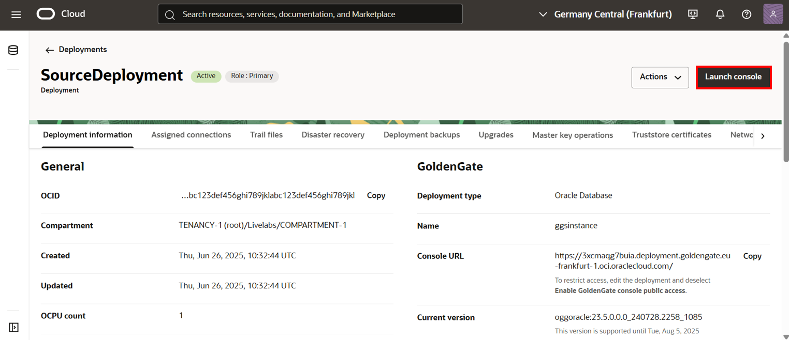
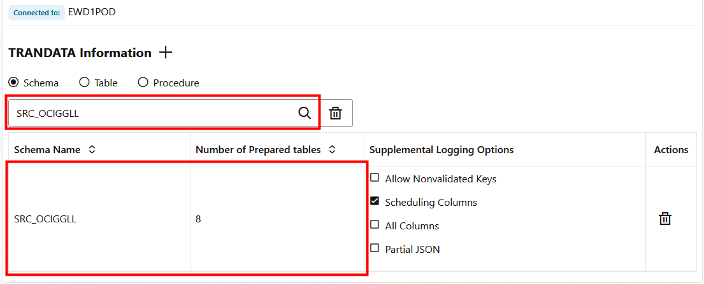

# Add and run the Extract

## Introduction

In this lab, you learn to add Transaction information (TRANDATA) and then add and run the Extract process in the source OCI GoldenGate deployment console.

Estimated time: 15 minutes

### About Transaction information 

Adding Transaction information (TRANDATA) allows Oracle GoldenGate to collect the information it needs from database transaction records.


### Objectives

In this lab, you will:
* Launch the OCI GoldenGate deployment console and log in
* Add transaction information
* Add and run an Extract


### Prerequisites

This lab assumes that you completed all preceding labs, and your deployment is in the Active state.


## Task 1: Add transaction information

1.  Use the Oracle Cloud Console navigation menu to navigate back to Deployments.

2.  On the Deployments page, select **SourceDeployment**.

3.  On the Deployment Details page, click **Launch Console**.

    

4.  On the OCI GoldenGate Deployment Console sign-in page, enter **oggadmin** for User Name and the password you provided when you created the deployment, and then click **Sign In**.

    > **NOTE**: If using OCI IAM, you must click **Allow** when prompted to give the application access to `get_groups`.

    

    You're brought to the OCI GoldenGate Deployment Console Home page after successfully signing in.

> **Note:** Ensure that you enable supplemental logging before adding an Extract or you may encounter errors. If you encounter errors, delete and add the Extract before trying again.

5.  Open the navigation menu and then click **Configuration**.

    

6.  Click **Connect to database SourceATP**.

    

7.  Next to **TRANDATA Information** click **Add TRANDATA** (plus icon).

    

8.  For **Schema Name**, enter `SRC_OCIGGLL`, and then click **Submit**.

    

9.  To verify, click **Search TRANDATA**, and then enter **SRC\_OCIGGLL** into the Search field and click **Search**.

    

    


To return to the GoldenGate Deployment Console Home page, click **Overview** in the left navigation.

## Task 2: Add and Run an Extract

1.  On the GoldenGate Deployment Console Home page, click **Add Extract** (plus icon).

    

2.  On the Add Extract page, select **Integrated Extract**, and then click **Next**.

    

3.  For **Process Name**, enter `EXTATP`.

4.  For **Trail Name**, enter `AE`.

5.  Under **Source Database Credential**, for **Credential Domain**, select **OracleGoldenGate**.

6.  For **Credential Alias**, select the **ATP_Source**.

    

7.  Under Managed Options, enable **Critical to deployment health**.

8.  Click **Next**.

    

9.  On the Parameter File page, in the text area, add a new line to the existing text and add the following:

    ```
    <copy>-- Capture DDL operations for listed schema tables
    ddl include mapped

    -- Add step-by-step history of ddl operations captured
    -- to the report file. Very useful when troubleshooting.
    ddloptions report

    -- Write capture stats per table to the report file daily.
    report at 00:01

    -- Rollover the report file weekly. Useful when IE runs
    -- without being stopped/started for long periods of time to
    -- keep the report files from becoming too large.
    reportrollover at 00:01 on Sunday

    -- Report total operations captured, and operations per second
    -- every 10 minutes.
    reportcount every 10 minutes, rate

    -- Table list for capture
    table SRC_OCIGGLL.*;</copy>
    ```

    

10. Click **Create**. You're returned to the OCI GoldenGate Deployment Console Home page.

11. In the EXTATP **Actions** menu, select **Start**. In the Confirm Action dialog, click **OK**.

    

    The yellow exclamation point icon changes to a green checkmark.

    


You may now **proceed to the next lab**.


## Learn more

* [Add TRANDATA](https://docs.oracle.com/en/middleware/goldengate/core/21.3/coredoc/extract-adding-extract.html#GUID-5848749D-282E-4DA9-9D65-00C34ED5F3BF)

You may now **proceed to the next lab**.

## Acknowledgements
* **Author** - Madhu Kumar S, Senior Solution Engineer, AppDev and Integration
* **Contributors** -  Denis Sendil, Database Product Management; Jenny Chan, Consulting User Assistance Developer, Database User Assistance
* **Last Updated By/Date** - Katherine Wardhana, User Assistance Developer, December 2023