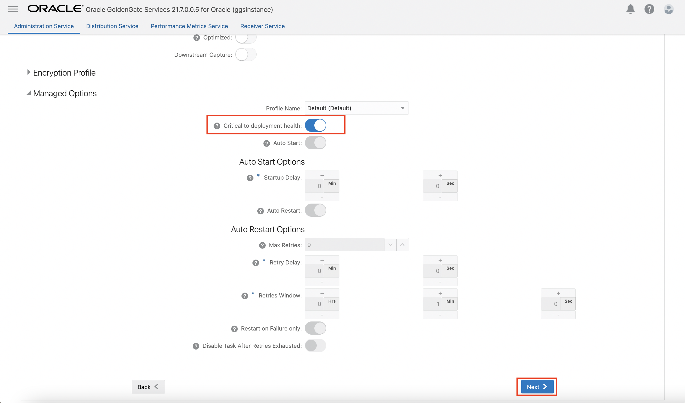
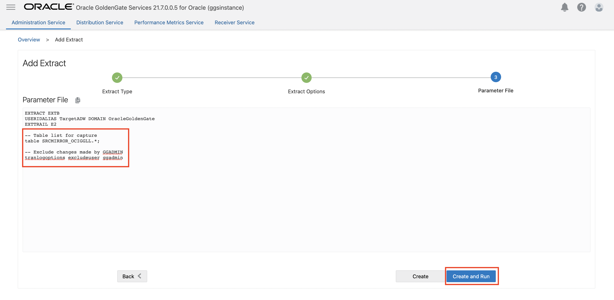
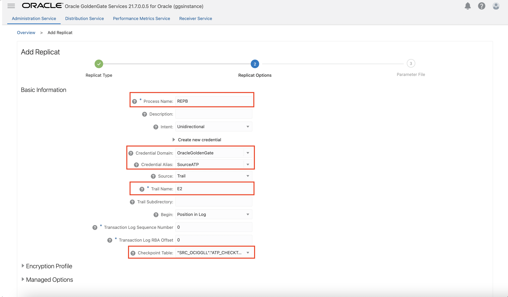
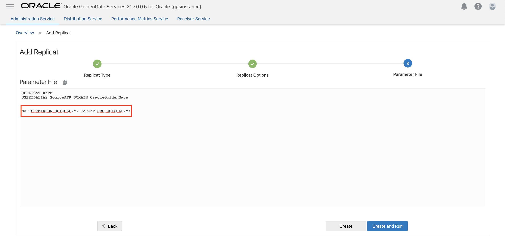
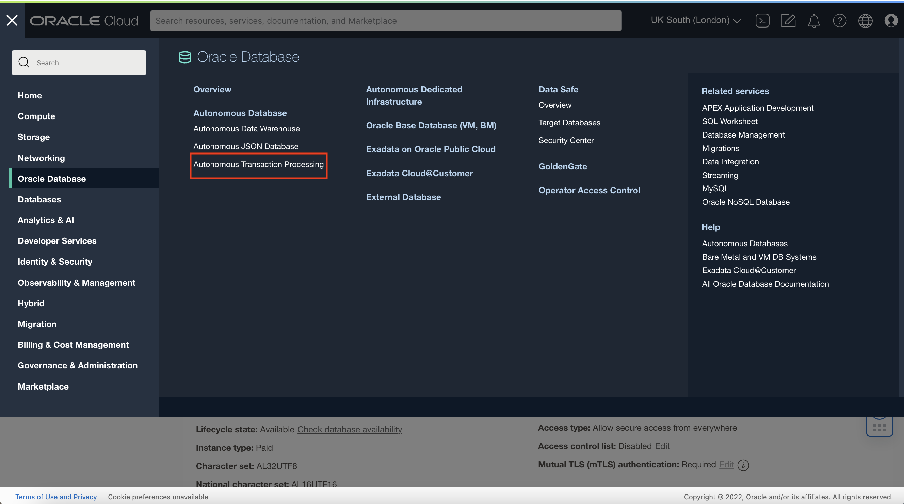
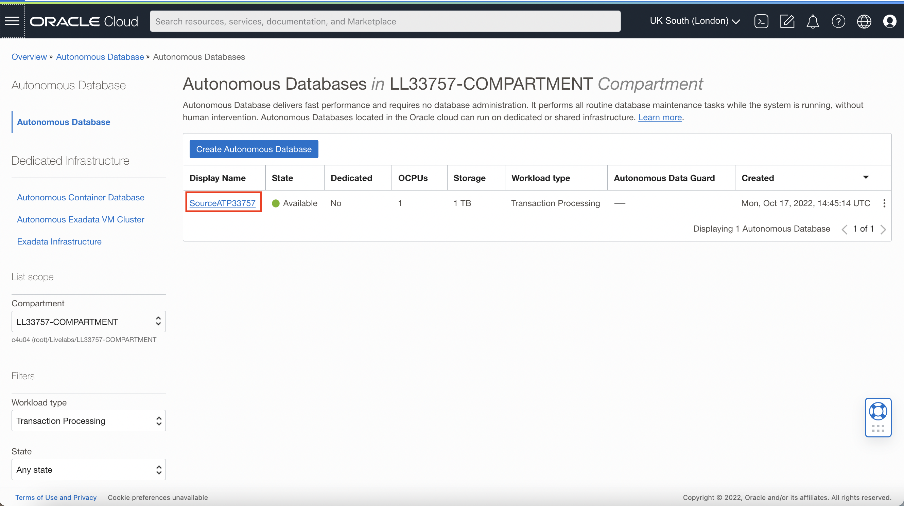
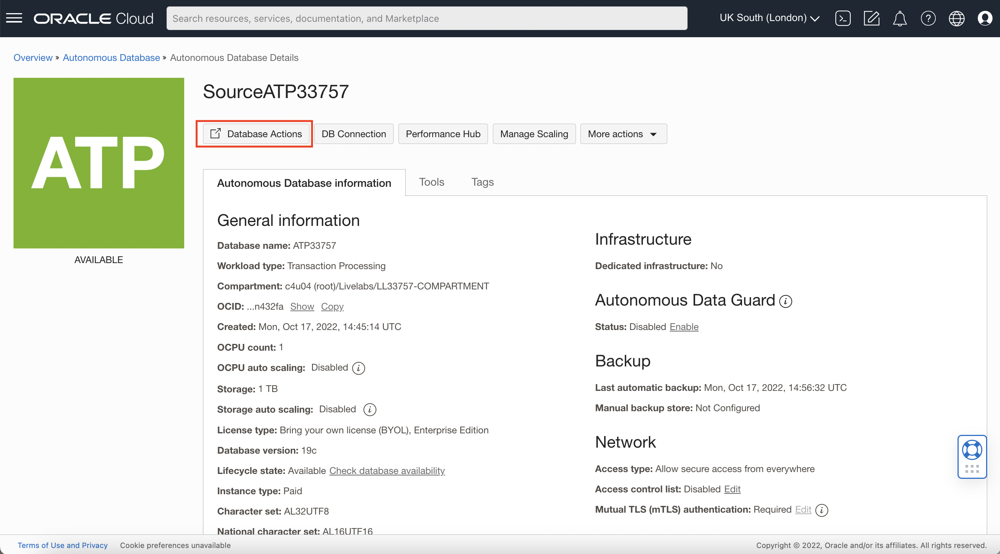

# Replicate data from target to source

## Introduction

Now that replication is established and verified from the source database to the target database, you can set up bidirectional replication from the target to the source. This lab walks you through the steps create and run an Extract on the target, and create and run a Replicat on the source in the Oracle Cloud Infrastructure (OCI) GoldenGate Deployment Console.

Estimated time: 20 minutes

### About Extracts and Replicats

An Extract is a process that extracts, or captures, data from a source database. A Replicat is a process that delivers data to a target database.

### Objectives

In this lab, you will:
* Add and run an Extract
* Add and run a Replicat
* Verify the replication from Autonomous Data Warehouse to Autonomous Transaction Processing

### Prerequisites

This lab assumes that you completed all preceding labs, and your deployment is in the Active state.

## Task 1: Add and run an Extract

1.  Return to the Overview screen and click **Add Extract**.
    
    

2.  On the Add Extract page, select **Integrated Extract**, and then click **Next**.
    
    

3.  On the Extract Options page, for Process Name, enter **EXTB**.

4.  For Trail Name, enter **E2**.

5.  From the Credential Domain dropdown, select **OracleGoldenGate**.

6.  From the Credential Alias dropdown, select **TargetADW**.

    

7.  Under Managed Options, select **Critical to deployment health**.

8.  Click **Next**.

    

9.  On the Parameter File page, in the text area, add a new line under EXTTRAIL E2, and then add the following:

    ```
    <copy>-- Table list for capture
table SRCMIRROR_OCIGGLL.*;

-- Exclude changes made by GGADMIN
tranlogoptions excludeuser ggadmin</copy>
    ```

10. Click **Create and Run**. You're returned to the Overview page. The EXTB Extract process is created.

    It may takes a few minutes for the extract to be created. The yellow exclamation point icon changes to a green checkmark. 

    


## Task 2: Add and run the Replicat

1.  Click **Add Replicat**.

    

2.  On the Add Replicat page, select **Nonintegrated Replicat**, and then click **Next**.

    

3.  For Process Name, enter **REPB**.

4.  From the Credential Domain dropdown, select **OracleGoldenGate**.

5.  From the Credential Alias dropdown, select **SourceATP**.

6.  For Trail Name, enter **E2**.

7.  For Checkpoint Table, select **"SRC\_OCIGGLL"."ATP\_CHECKTABLE"**.

    

8.  Under Managed Options, select **Critical to deployment health**.

9.  Click **Next**.

    

10. On the Parameter File page, in the text area, replace **MAP \*.\*, TARGET \*.\*;** with the following:

    ```
    <copy>MAP SRCMIRROR_OCIGGLL.*, TARGET SRC_OCIGGLL.*;</copy>
    ```
    

11. Click **Create and Run**. You're returned to the Overview page. The Replicat process is created.

    It may takes a few minutes for the extract to be created. The yellow exclamation point icon changes to a green checkmark. 

    

## Task 3: Perform Inserts to the Source Database

1.  Return to the Oracle Cloud Console and use the navigation menu (hamburger icon) to navigate back to **Oracle Database**, **Autonomous Transaction Processing**, and then **SourceATP**.

    

    

2.  On the Source ATP Details page, click **Database Actions**.

    

3.  Click **SQL**.

    

4.  Enter the following inserts, and then click **Run Script**:

    ```
    <copy>Insert into SRC_OCIGGLL.SRC_CITY (CITY_ID,CITY,REGION_ID,POPULATION) values (2000,'Houston',20,743113);
Insert into SRC_OCIGGLL.SRC_CITY (CITY_ID,CITY,REGION_ID,POPULATION) values (2001,'Dallas',20,822416);
Insert into SRC_OCIGGLL.SRC_CITY (CITY_ID,CITY,REGION_ID,POPULATION) values (2002,'San Francisco',21,157574);
Insert into SRC_OCIGGLL.SRC_CITY (CITY_ID,CITY,REGION_ID,POPULATION) values (2003,'Los Angeles',21,743878);
Insert into SRC_OCIGGLL.SRC_CITY (CITY_ID,CITY,REGION_ID,POPULATION) values (2004,'San Diego',21,840689);
Insert into SRC_OCIGGLL.SRC_CITY (CITY_ID,CITY,REGION_ID,POPULATION) values (2005,'Chicago',23,616472);
Insert into SRC_OCIGGLL.SRC_CITY (CITY_ID,CITY,REGION_ID,POPULATION) values (2006,'Memphis',23,580075);
Insert into SRC_OCIGGLL.SRC_CITY (CITY_ID,CITY,REGION_ID,POPULATION) values (2007,'New York City',22,124434);
Insert into SRC_OCIGGLL.SRC_CITY (CITY_ID,CITY,REGION_ID,POPULATION) values (2008,'Boston',22,275581);
Insert into SRC_OCIGGLL.SRC_CITY (CITY_ID,CITY,REGION_ID,POPULATION) values (2009,'Washington D.C.',22,688002);</copy>
    ```
    

5.  In the OCI GoldenGate Deployment Console, click the **Extract name (EXTB)**, and then click **Statistics**. Verify that **SRC\_OCIGGLL.SRC\_CITY** is listed with 10 inserts.

    

6.  Go back to the Overview screen, click the **Replicat name (REPB)**, and then click **Statistics**. Verify that **SRC\_OCIGGLL.SRC\_CITY** is listed with 10 inserts.

    


## Learn more

* [Creating an Extract](https://docs.oracle.com/en/cloud/paas/goldengate-service/eeske/index.html)
* [Creating a Replicat](https://docs.oracle.com/en/cloud/paas/goldengate-service/cress/index.html)

## Acknowledgements
* **Author** - Jenny Chan, Consulting User Assistance Developer, Database User Assistance
* **Contributors** -  Julien Testut, Database Product Management & Katherine Wardhana, User Assistance Developer
* **Last Updated By/Date** - Katherine Wardhana, October 2022
