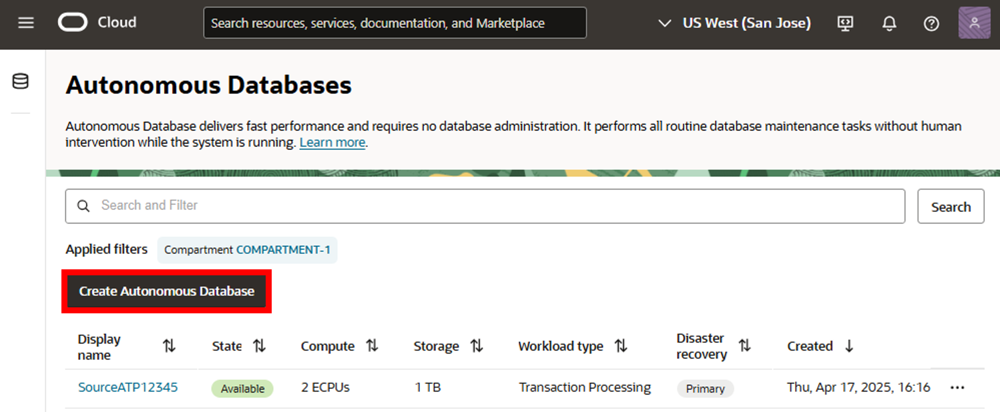

<!--
    {
        "name":"Create the ADW instance",
        "description":"Create the ADW instance"
    }
-->
1.  Open the **Navigation Menu**, navigate to **Oracle Database**, and select **Autonomous Data Warehouse**.

	

2.  Click **Create Autonomous Database**.

    

3. Select **Compartment** by clicking on the drop-down list. (Note that yours will be different - do not select **ManagedCompartmentforPaaS**) and then enter **TargetADW** for **Display Name** and **Database Name**.

    

4.  Under **Choose a workload type**, select **Data Warehouse**.

5.  Under **Choose a deployment type**, select **Serverless**.

    

6.  Under **Configure the database**, leave **Choose database version** and **Storage (TB)** and **OCPU Count** as they are.

7.  Add a password. Note the password down in a notepad, you will need it later.

    

8. Under **Access type**, select **Secure access from everywhere**.

9.  Select **Require mutual TLS (mTLS) authentication**.

    

10.  For **Choose license and Oracle Database edition**, use the default selection.

    

11.  Click **Create Autonomous Database**. Once it finishes provisioning, you can click on the instance name to see details of it.