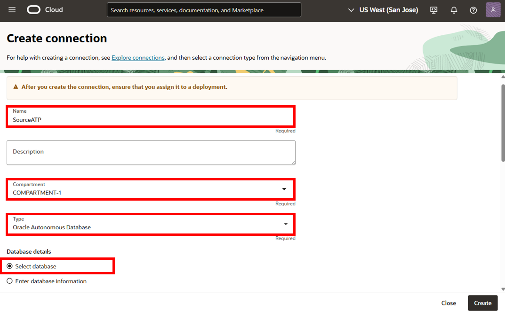

<!--
    {
        "name":"Create the source connection",
        "description":"Create the source connection"
    }
-->
1.  Use the Oracle Cloud Console breadcrumb to navigate back to the Deployments page.

    

2.  Click **Connections**.

    

3.  Click **Create connection**.

    

4.  The Create connection panel consists of two pages. On the General information page, for Name, enter **SourceATP** and optionally, a description.

5.  From the Compartment dropdown, select **&lt;USER&gt;-COMPARTMENT**.

6.  From the a Type dropdown, select **Oracle Autonomous Database**.

7.  Click **Next**.

    

8. On the Connection details page, under Database details, select **Select database**.

9.  For **Database in &lt;compartment-name&gt;**, select **SourceATP-&lt;numbers&gt;** from the dropdown. 

10.  For Database username, enter `ggadmin`.

11.  Enter the database's password in the Password field. Take note of the password.

    > **NOTE:** This password will be used to unlock `GGADMIN` in Task 3.

12. For Traffic routing method, select **Shared endpoint**.

13. For Session mode, select **Direct**.

14. Click **Create**

    

    The connection becomes Active after a few minutes.