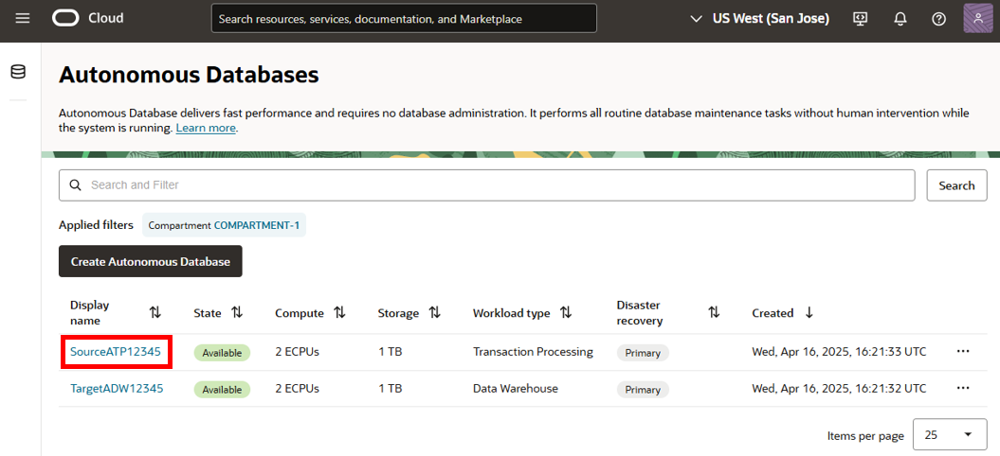
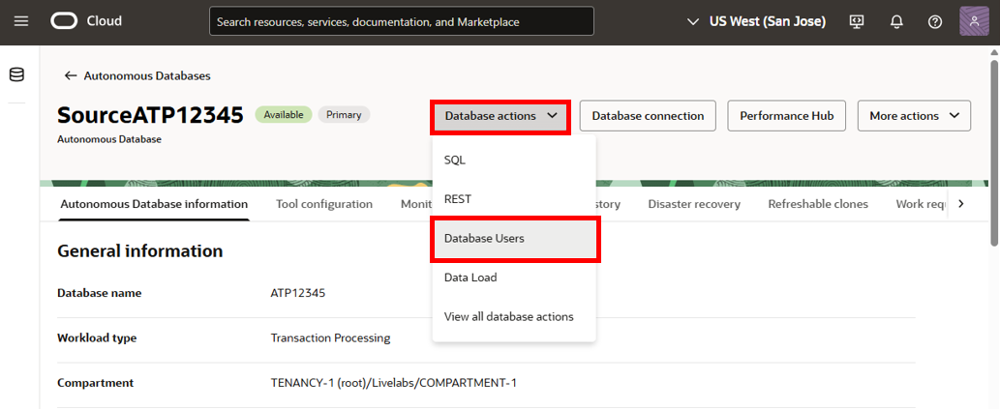
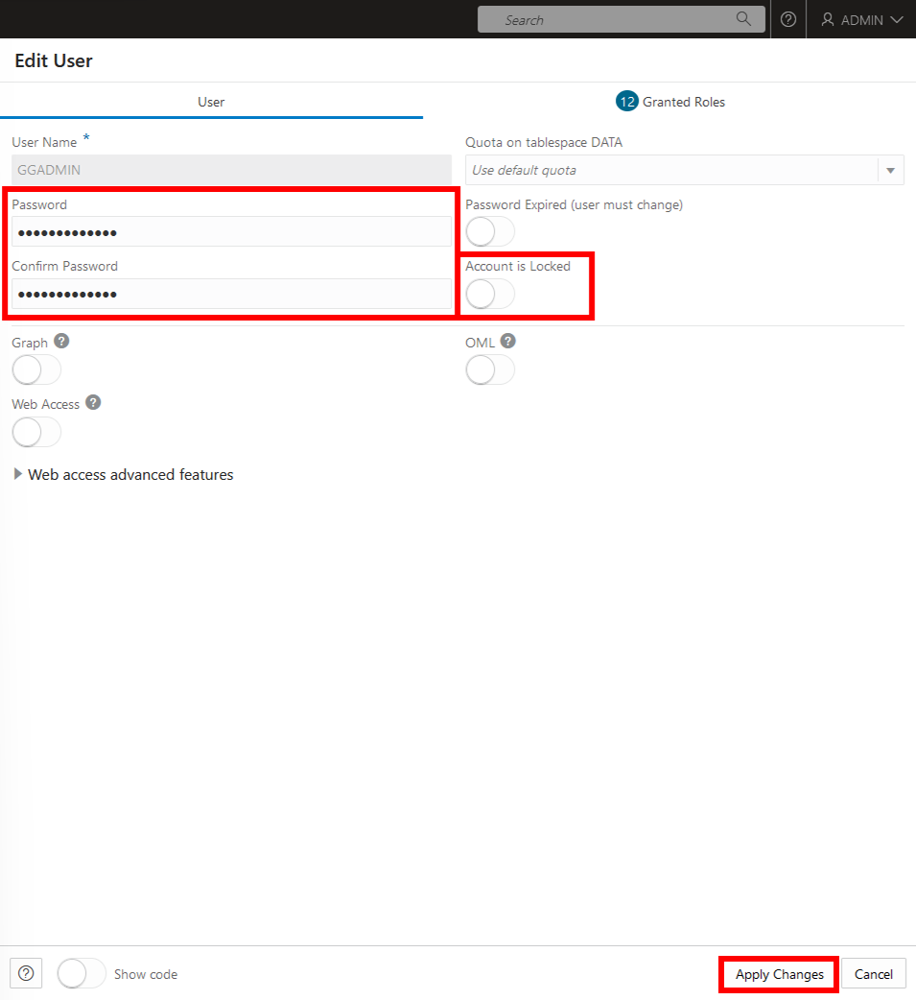
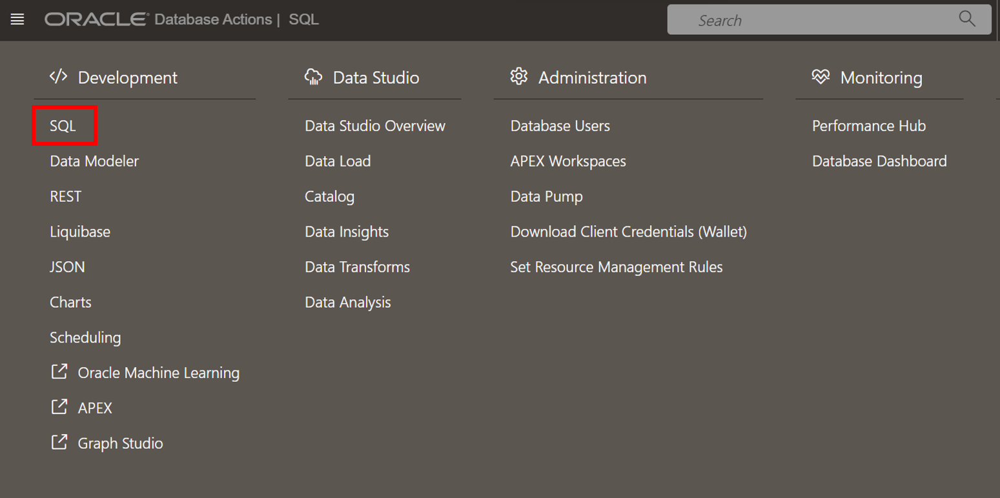
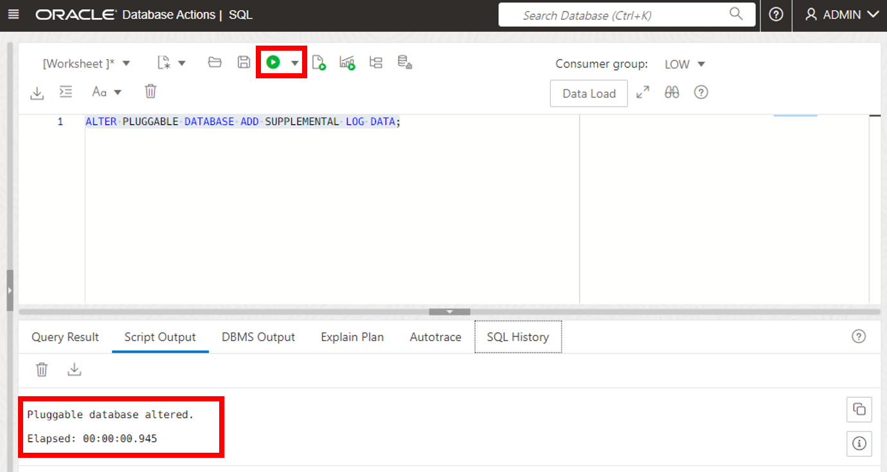
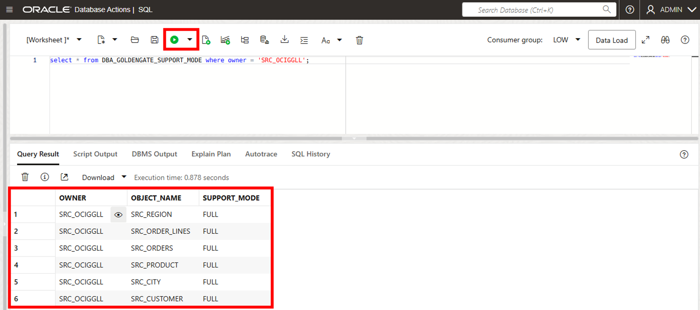

<!--
    {
        "name":"Unlock the GGADMIN user and enable supplemental logging for the source database",
        "description":"Unlock the GGADMIN user and enable supplemental logging for the source database"
    }
-->
Oracle Autonomous Databases come with a GGADMIN user that is locked by default. The following steps guide you through how to unlock the GGADMIN user.

1.  From the Oracle Cloud Console navigation menu, click **Oracle Database**, and then select **Autonomous Transaction Processing**.

	

2.  From the list of databases, select **SourceATP**.

    

3.  On the SourceATP Database Details page, click **Database actions**, and then select **Database Users** from the dropdown. If the Database actions menu takes too long to load, you can click **Database actions** directly, and then select **Database users** from the Database actions page.

    

4.  If prompted, log in to Database actions as **admin**, using the ATP Admin Password from **View Login Info** in your Workshop instructions.

    

5.  From the list of users, locate **GGADMIN**, and then click the ellipsis (three dots) icon and select **Edit**.

    

6.  In the Edit User panel, deselect **Account is Locked**, enter the password you gave the ggadmin user in the Task 2, Step 10, and then click **Apply Changes**.

    

    Note that the user icon changes from a padlock to a checkmark.

7.  Open the Database actions navigation menu, and then under **Development**, select **SQL**.

    

    > **Note:**  (Optional) Close the SQL Help dialogs. 

8.  Enter the following into the Worksheet, and then click **Run Statement**.

    ```
    <copy>ALTER PLUGGABLE DATABASE ADD SUPPLEMENTAL LOG DATA;</copy>
    ```

    

9.  Replace the supplemental logging script with the following to check support mode, and then click **Run Statement**:

    ```
    <copy>
    select * from DBA_GOLDENGATE_SUPPORT_MODE where owner = 'SRC_OCIGGLL';
    </copy>
    ```

    The Script Output panel displays six tables whose Support_Mode is **FULL**.

    

    You can leave the SQL window open and continue with the next Task.