# Send the OCI GoldenGate Trail File to Oracle GoldenGate

## Introduction

This lab walks you through the steps to capture and send data from Oracle Cloud Infrastructure (OCI) GoldenGate to an on premises or Marketplace Oracle GoldenGate instance. You'll create an Extract to capture data from the source database, a Receiver Path to initiate pulling the data down to the target, and a Replicat to consume the data received.

Estimated time: 25 minutes

### About Extracts, Paths, and Replicats
An Extract is a process that extracts, or captures, data from a source database. A Receiver Path is a target-initiated configuration that uses the Receiver Server. A Replicat is a process that delivers data to the target.

### Objectives

In this lab, you will:
* Add and run an Extract process to capture data
* Add and run a Receiver Path to pull the trail file down to Oracle GoldenGate
* Add and run a Replicat process to consume the trail file received from OCI GoldenGate

### Prerequisites

This lab assumes that you completed all preceding labs. For the purposes of this lab, the source database used in this lab is Oracle Autonomous Transaction Processing and the target database is Oracle Autonomous Data Warehouse.

## Task 1: Add Transaction Data

1.  In the OCI GoldenGate Deployment console, select **Overview** from the navigation menu (hamburger icon), and then click **DB Connections**.

    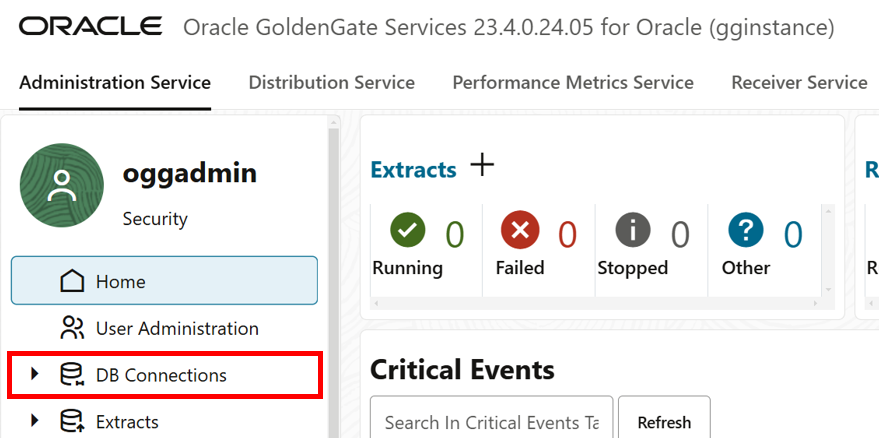

2.  Click **Connect to database SourceATP**.

    

3.  Next to **TRANDATA Information** click **Add TRANDATA**.

    

4.  For **Schema Name**, enter **SRC\_OCIGGLL**, and then click **Submit**. You only need to click Submit once. Click Search, and then enter SRC_OCIGGLL to verify.

    

    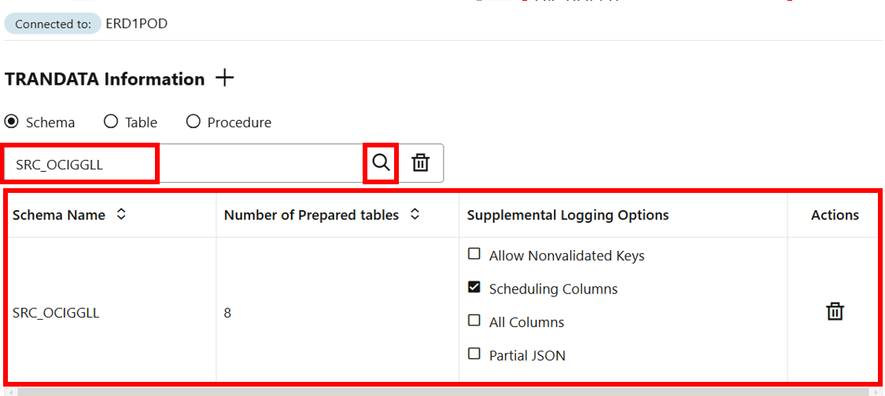

## Task 2: Add and Run an Extract in OCI GoldenGate

This Extract process captures data from the source database to send to Oracle GoldenGate.

1.  In the OCI GoldenGate Deployment console, select **Overview** from the navigation menu (hamburger icon), and then click **Add Extract** (plus icon).

    

2.  The Add Extract panel consists of five pages. On the Extract Information page, complete the following fields, and then click **Next**:

    *  For **Extract Type**, select **Integrated Extract**.
    *  For **Process Name**, enter a name for this Extract process, such as UAEXT.

    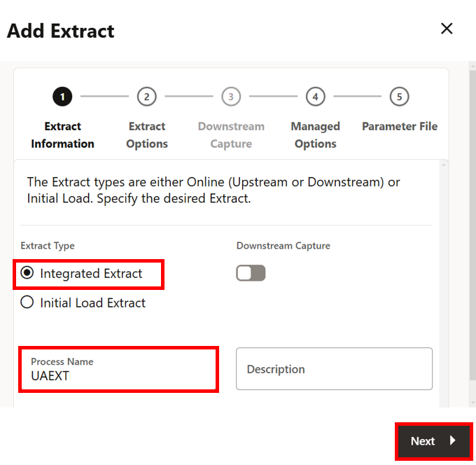

3. On the Extract Options page, complete the following fields, and then click **Next**:

    *  For **Domain**, select **OracleGoldenGate** from the dropdown.
    *  For **Alias**, select the Credential Alias for the source Autonomous Transaction Processing database.
    * For **Trail Name**, enter a two-character name for the Trail file, such as E1.

    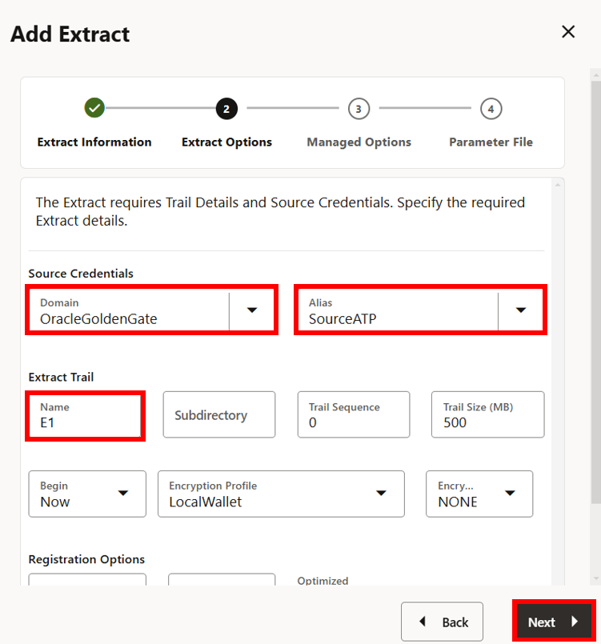

4. On the Managed Options page, leave the fields as they are, and click **Next**.

    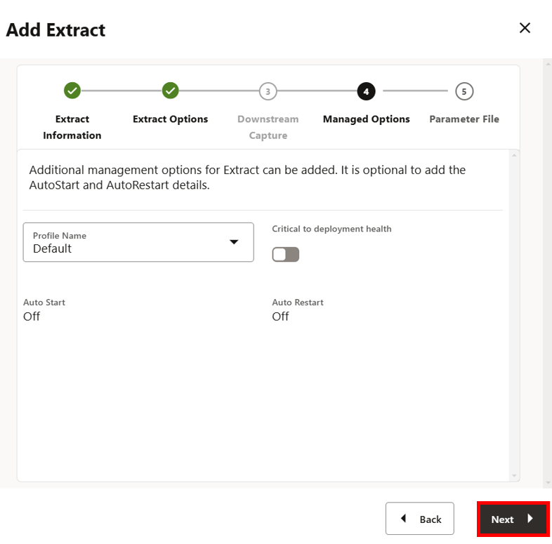

5.  In the Parameter File page, add a new line, paste the following to the text area, and then click **Create**:

    ```
    <copy>Table SRC_OCIGGLL.*;</copy>
    ```

    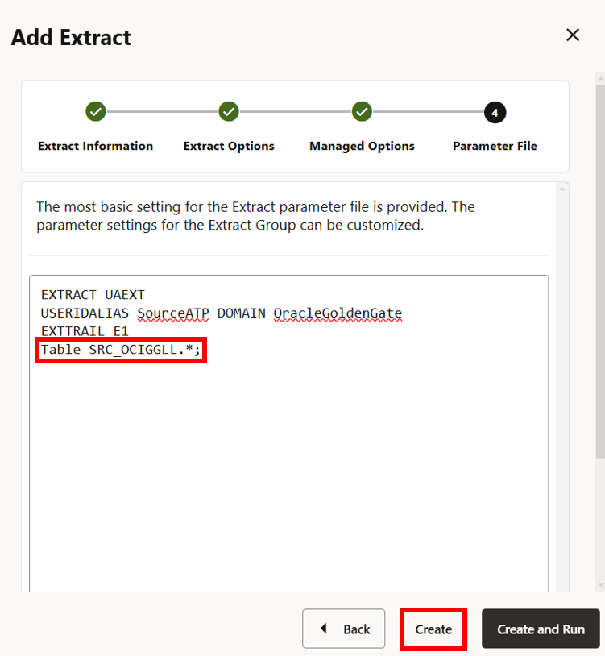

    You're returned to the Administration Server Overview page.

6.  In the UAEXT **Action** menu, select **Start**. In the Confirm Action dialog, click **OK**.

    

    

## Task 3: Add and Run a Target-Initiated Path

The Target-Initiated Path initiates the process to pull the OCI GoldenGate trail file down to Oracle GoldenGate.

1.  In the Marketplace Oracle GoldenGate Administration Server console, click **Receiver Server**.

    

2.  Click **Add Target-Initiated Path** (plus icon).

    

3.  The Add Path panel consists of six pages. On the Path Information page, complete the following fields, and then click **Next**:

    *  For **Path Name**, enter a name for this Path. For example, **GGStoOGG**.
    *  For **Description**, optionally, enter a description.

    

4. On the Source Options page, complete the following fields, and then click **Next**:

    *  For **Source Host**, enter the OCI GoldenGate hostname in the following format: **&lt;domain&gt;.deployment.goldengate.us-&lt;region&gt;-1.oci.oraclecloud.com**.

    >**NOTE:** You can copy the host from the browser address bar of your OCI GoldenGate Deployment Console window, or copy the Console URL from the Deployment Details page and remove the https:// and any trailing slashes (/).

    
    
    *  For **Port Number**, enter 443.
    *  For **Trail Number**, enter E1.
    *  For **Alias**,  enter the Alias from Lab 3, Task 3, step 4. For example, **ggs2ogg**.

    

5. On the Target Options page, for **Trail Name**, enter a two-character name for the Trail file when it is received by Oracle GoldenGate. For example, **T1**, and then click **Next**.

    

6. On the Advanced Options page, leave the fields as they are, and click **Next**.

    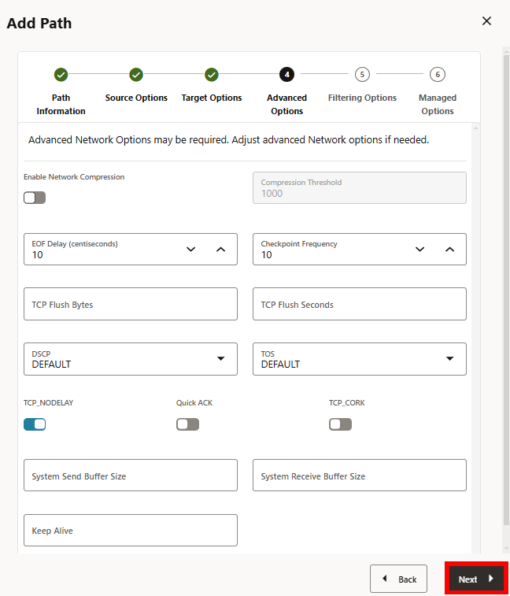

7. On the Filtering Options page, leave the fields as they are, and click **Next**.

    

8. On the Managed Options page, leave the fields as they are, and click **Create Path**.

    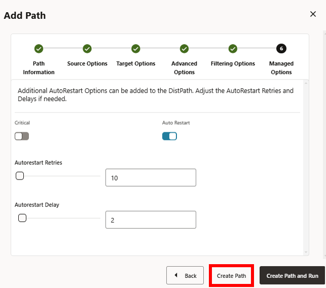

9. Return to the Receiver Server Overview page, and then select **Start** from the Target-Initiated Path's **Action** menu.

10. In the OCI GoldenGate Deployment Console, check the Distribution Service for the Distribution Path. It can take a few minutes before it appears.

In this lab, you created and ran a Path on your on premises Oracle GoldenGate Receiver Server and sent a trail file from OCI GoldenGate to Oracle GoldenGate.

## Task 4: Add a Checkpoint Table

1.  In the Oracle GoldenGate Marketplace Administration Server, click **Administration Server**, and then open the navigation menu to select **DB Connections**.

    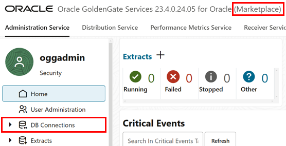

2.  For target Autonomous Data Warehouse database, click **Connect to Database**.

    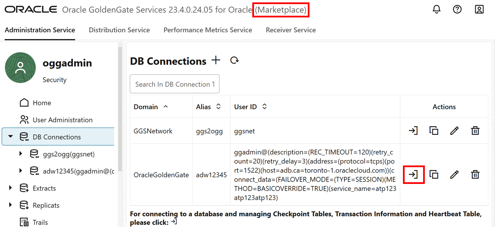

3.  Next to Checkpoint, click **Add Checkpoint**.

    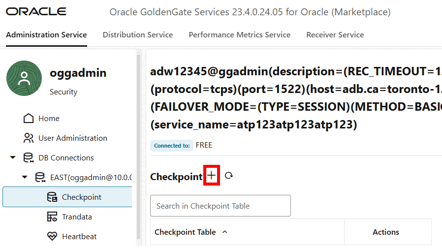

4.  For **Checkpoint Table**, enter **"SRCMIRROR\_OCIGGLL"."CHECKTABLE"**, and then click **Submit**.

    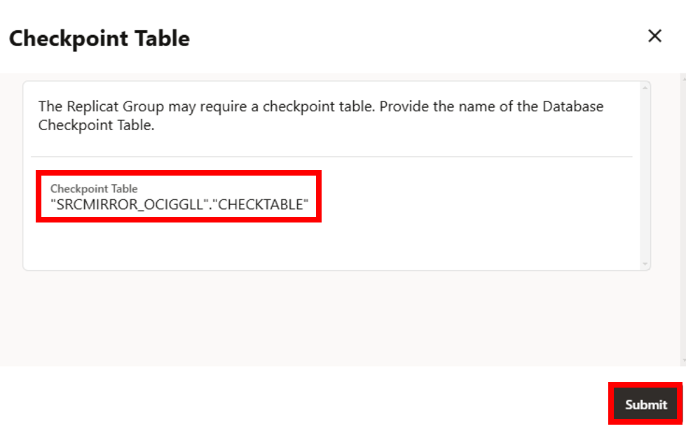


## Task 5: Add and Run a Replicat

This Replicat process consumes the trail file sent from OCI GoldenGate.

1.  Click **Overview**, and then click **Add Replicat** (plus icon).

    

2. The Add Replicat panel consists of four pages. On the Replicat Information page, complete the following fields, and then click **Next**:

    *  For **Replicat Type**, select **Nonintegrated Extract**.
    *  For **Process Name**, enter a name for this Extract process, such as REP.

    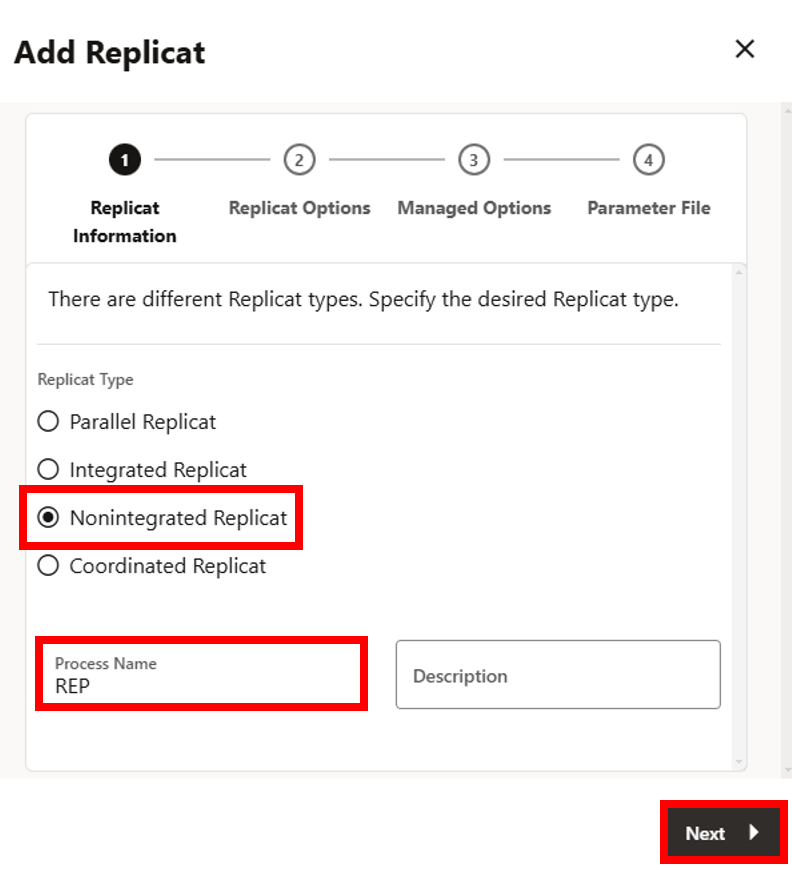

3.  On the Replicat Options page, complete the following fields, and then click **Next**:

    *  For **Replicat Trail Name**, enter **T1**.
    *  For **Domain**, select **OracleGoldenGate**.
    *  For **Alias**, select **TargetADW**.
    *  For **Checkpoint Table**, select **"SRCMIRROR\_OCIGGLL"."CHECKTABLE"**.

    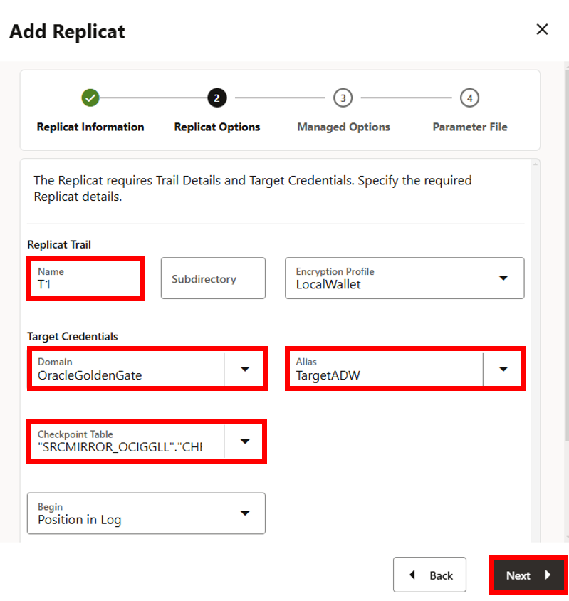

4. On the Managed Options page, leave the fields as they are, and click **Next**.

    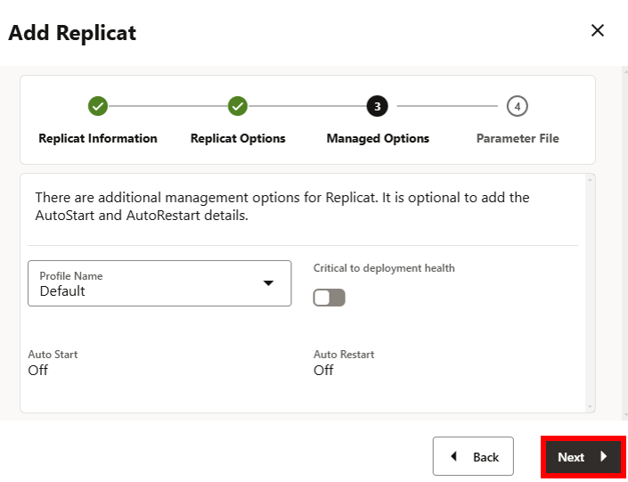

5. On the Parameter File page, in the text area, replace  **MAP \*.\*, TARGET \*.\*;** with the following script:

    ```
    <copy>MAP SRC\_OCIGGLL.\*, TARGET SRCMIRROR\_OCIGGLL.\*;</copy>
    ```

6.  Click **Create**.

    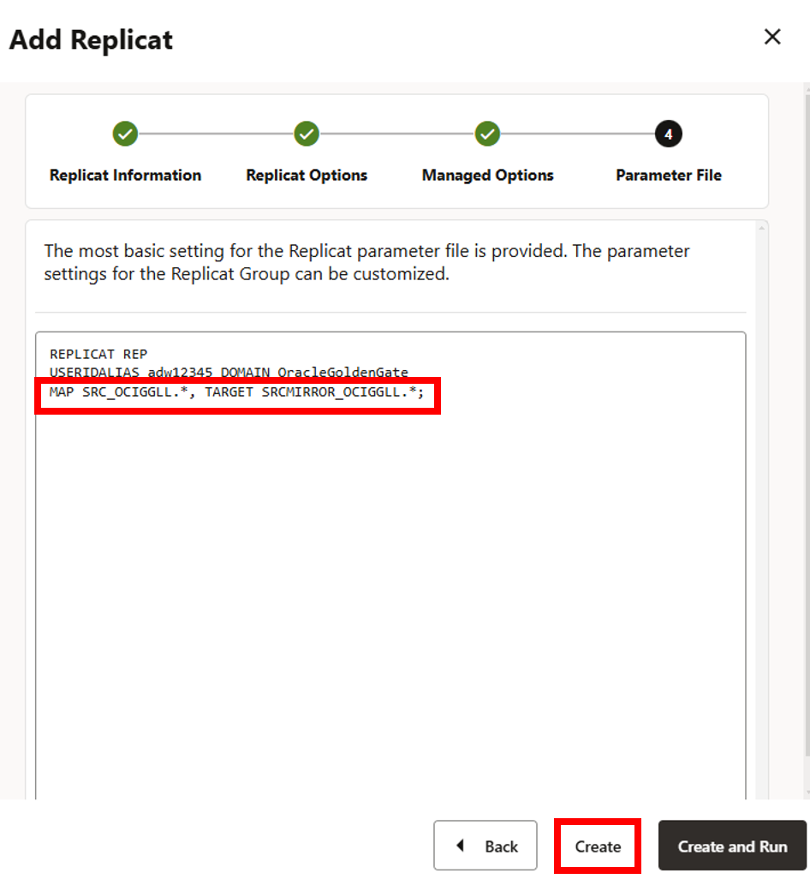

7. The REP Replicat appears. In the REP **Action** menu, select **Start**. In the Confirm Action dialog, click **OK**.

    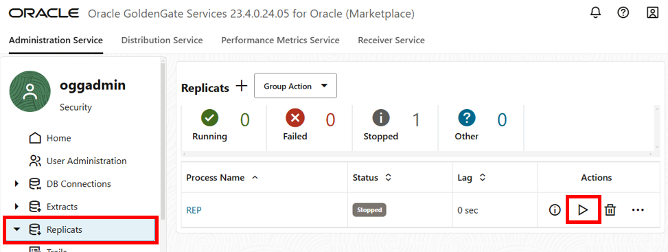

    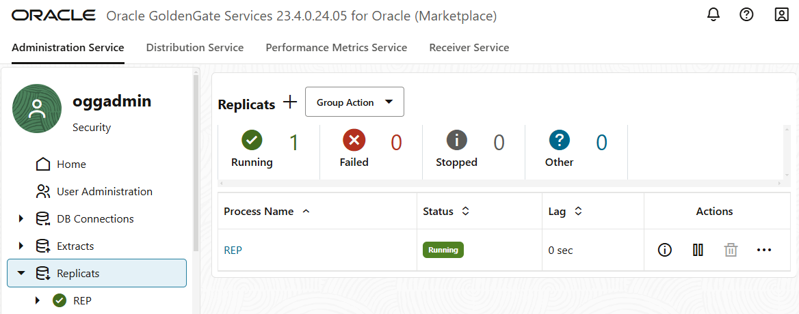 

8. Return to the OCI Console and use the navigation menu (hamburger icon) to navigate back to **Oracle Database**, **Autonomous Transaction Processing**, and then **SourceATP**.

9. On the Source Autonomous Transaction Processing Details page, click **Database Actions**.

10. Use the Source Autonomous Transaction Processing database credentials in the Workshop details to log in to Database Actions, and then click **SQL**.

11. Enter the following inserts, and then click **Run Script**:

    ```
    <copy>Insert into SRC_OCIGGLL.SRC_CITY (CITY_ID,CITY,REGION_ID,POPULATION) values (1000,'Houston',20,743113);
Insert into SRC_OCIGGLL.SRC_CITY (CITY_ID,CITY,REGION_ID,POPULATION) values (1001,'Dallas',20,822416);
Insert into SRC_OCIGGLL.SRC_CITY (CITY_ID,CITY,REGION_ID,POPULATION) values (1002,'San Francisco',21,157574);
Insert into SRC_OCIGGLL.SRC_CITY (CITY_ID,CITY,REGION_ID,POPULATION) values (1003,'Los Angeles',21,743878);
Insert into SRC_OCIGGLL.SRC_CITY (CITY_ID,CITY,REGION_ID,POPULATION) values (1004,'San Diego',21,840689);
Insert into SRC_OCIGGLL.SRC_CITY (CITY_ID,CITY,REGION_ID,POPULATION) values (1005,'Chicago',23,616472);
Insert into SRC_OCIGGLL.SRC_CITY (CITY_ID,CITY,REGION_ID,POPULATION) values (1006,'Memphis',23,580075);
Insert into SRC_OCIGGLL.SRC_CITY (CITY_ID,CITY,REGION_ID,POPULATION) values (1007,'New York City',22,124434);
Insert into SRC_OCIGGLL.SRC_CITY (CITY_ID,CITY,REGION_ID,POPULATION) values (1008,'Boston',22,275581);
Insert into SRC_OCIGGLL.SRC_CITY (CITY_ID,CITY,REGION_ID,POPULATION) values (1009,'Washington D.C.',22,688002);</copy>
    ```

12. In the OCI GoldenGate Deployment Console, select **Overview** from the navigation menu (hamburger icon), click the **Extract name (UAEXT)**, and then click **Statistics**. Verify that **SRC\_OCIGGLL.SRC\_CITY** is listed with 10 inserts.

    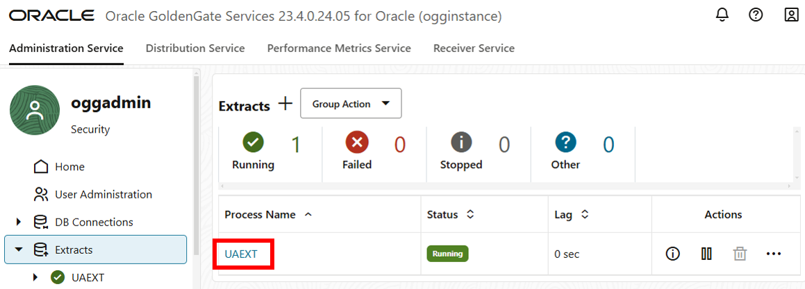

    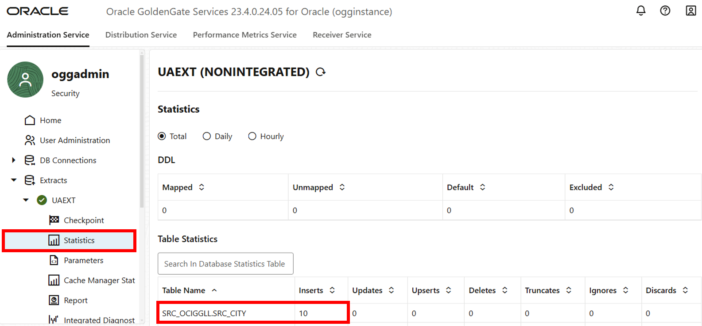

13. Navigate to the Oracle GoldenGate Marketplace Receiver Server. From the **Action** menu, select **Details**, and then **Statistics**. Verify that **SRC\_OCIGGLL.SRC\_CITY** is listed with 10 inserts.

    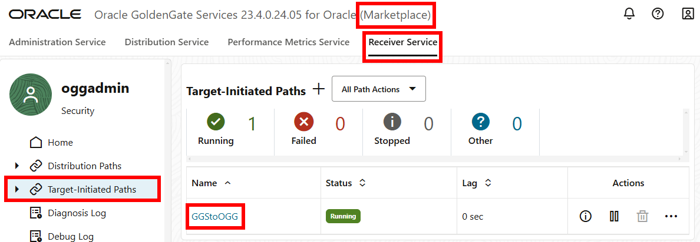

    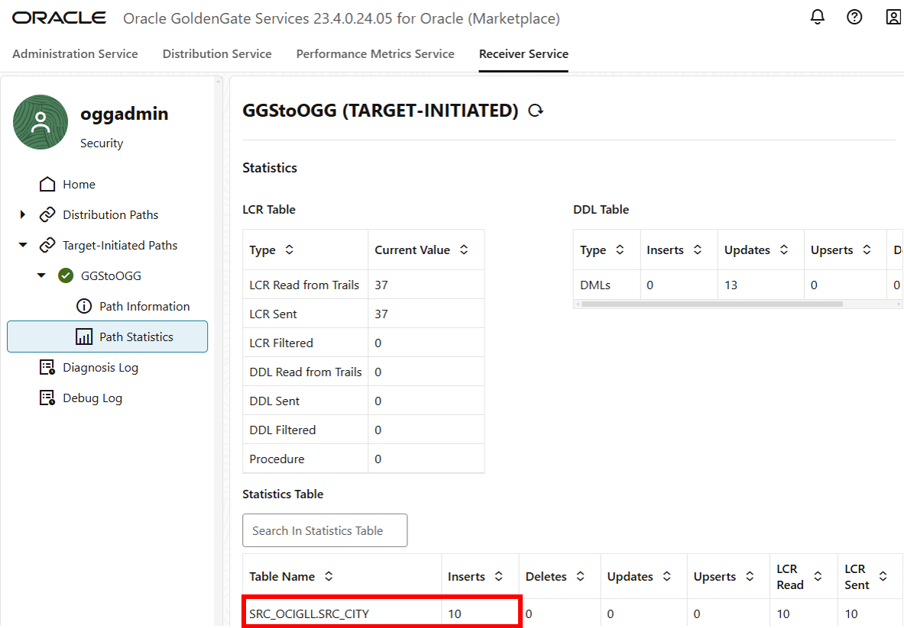

## Task 6: Confirm the Receiver Path is Running

1.  In the Oracle GoldenGate Marketplace Receiver Server, verify the Receiver Path is running.

    

In this lab, you created an Extract, a Receiver Path, and a Replicat, and you verified that data is moving from OCI GoldenGate to Oracle GoldenGate. You may now **proceed to the next lab**.

## Learn More

* [Quickstart - Sending Data from OCI GoldenGate to Oracle GoldenGate](https://docs.oracle.com/en/cloud/paas/goldengate-service/swjeg/index.html#articletitle)
* [Creating an Extract](https://docs.oracle.com/en/cloud/paas/goldengate-service/eeske/index.html)
* [Add a Receiver Path](https://docs.oracle.com/en/cloud/paas/goldengate-service/amlzc/index.html)

## Acknowledgements
* **Author** - Jenny Chan, Consulting User Assistance Developer, Database User Assistance
* **Contributors** -  Werner He and Julien Testut, Database Product Management; Katherine Wardhana, User Assistance Developer
* **Last Updated By/Date** - Katherine Wardhana, December 2024
