# Connect and prepare databases
## Introduction

This lab walks you through the steps to launch the Oracle GoldenGate 23ai Microservices WebUI, create a connection to a source database, add Trandata information, add a checkpoint table, add a heartbeat table, and create a custom-managed profile in the Oracle GoldenGate East and West 23ai Microservices WebUI.

Estimated time: 20 minutes

   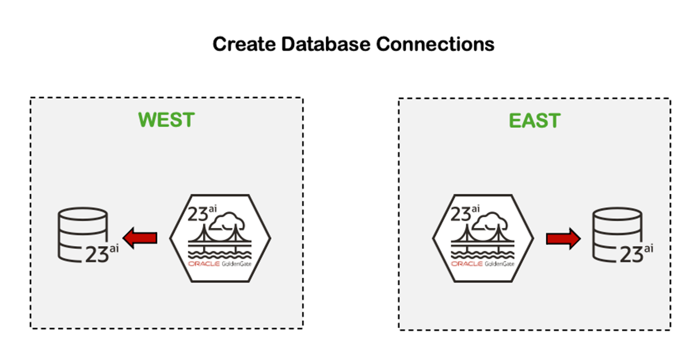

### About DB Connections

DB Connections is a database login credential that allows you to connect to a database and manage Checkpoint Tables, Trandata Information, and a Heartbeat Table.

### About Checkpoint table and Trandata

A Checkpoint table is created in the database to add fault tolerance to a Replicat process. Trandata enables the unconditional logging of the primary key and the conditional supplemental logging of all unique and foreign keys of the specified table.

### About Heartbeat tables

Heartbeat tables monitor lag throughout the data replication cycle. Automatic heartbeats are sent from each source database into the replication streams by updating the records in a heartbeat seed table and a heartbeat table and constructing a heartbeat history record.

### About Managed Process Profiles

A Custom-managed profile provides the name of the auto start and auto restart profile. You can select the default or custom options.

### Objectives

In this lab, you will:
* Log in to the Oracle GoldenGate 23ai Microservices WebUI
* Create a Connection to the East and West Source database
* Add Trandata information, a checkpoint table, and a heartbeat table
* Create a custom-managed Profile

## Task 1: Add DB Connection to East database

1. In your lab instructions, click **View Login Info**.

    

2. On the Reservation Information page, click on the **ogg\_east\_url** link to access the Oracle GoldenGate East 23ai Microservices WebUI console.

3.  To log in to the Oracle GoldenGate East 23ai Microservices WebUI console, enter **oggadmin** for Username and the Password, and then click **Sign In**. 

    > **NOTE:** If using the LiveLab Sandbox environment, copy the deployment password from the Terraform output section of **View Login Info**.

    

    After you log in successfully, you're brought to the Oracle GoldenGate 23ai deployment console home page. Here, you can access the GoldenGate Administration, Performance Metrics, Distribution, and Receiver Services, as well as add Extracts and Replicats for your data replication tasks.

4. In the navigation menu and click **DB Connections**.

    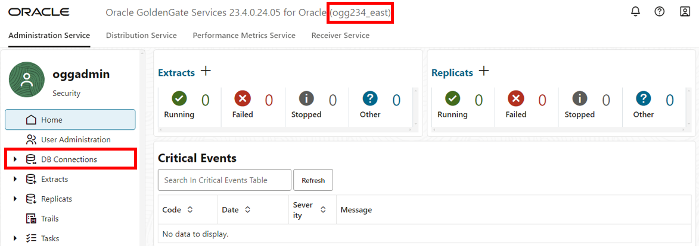

5. Click **Add DB Connection** (plus icon).

    

6. A Credentials panel will appear, complete the following fields, and then click **Submit**:
    * For Credential Alias, enter **EAST**.
    * For User ID, paste the **db\_east\_private\_connection** value from the Reservation Information. 
    * For Password, paste the **Global Password** from the Reservation Information. Verify the password. 

    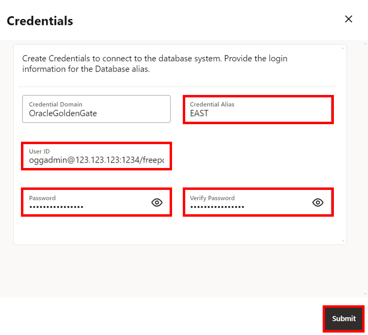

7. Click **Connect to database**. If successful, you are directed to the Checkpoint page. 

    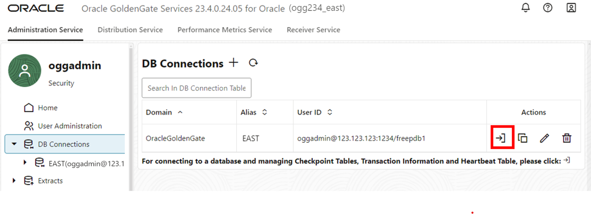

## Task 2: Add a Checkpoint table, Trandata information, and Heartbeat table

1. In the navigation menu, click **Checkpoint**. In the Checkpoint page, click **Add Checkpoint** (plus icon).

    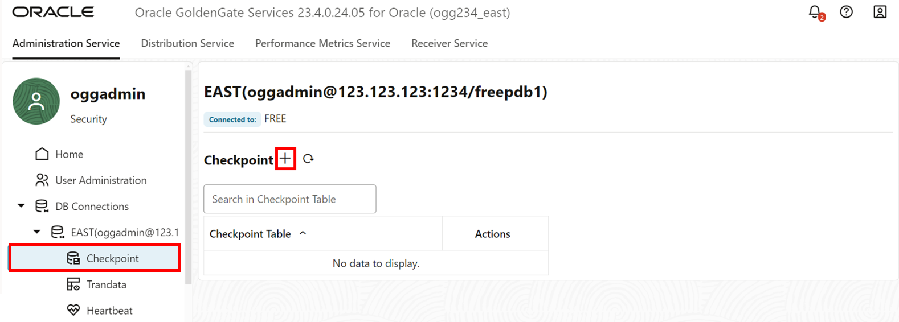

2. A Checkpoint Table panel appears. For Checkpoint Table, enter **oggadmin.checkpointtable**, and then click **Submit**.

    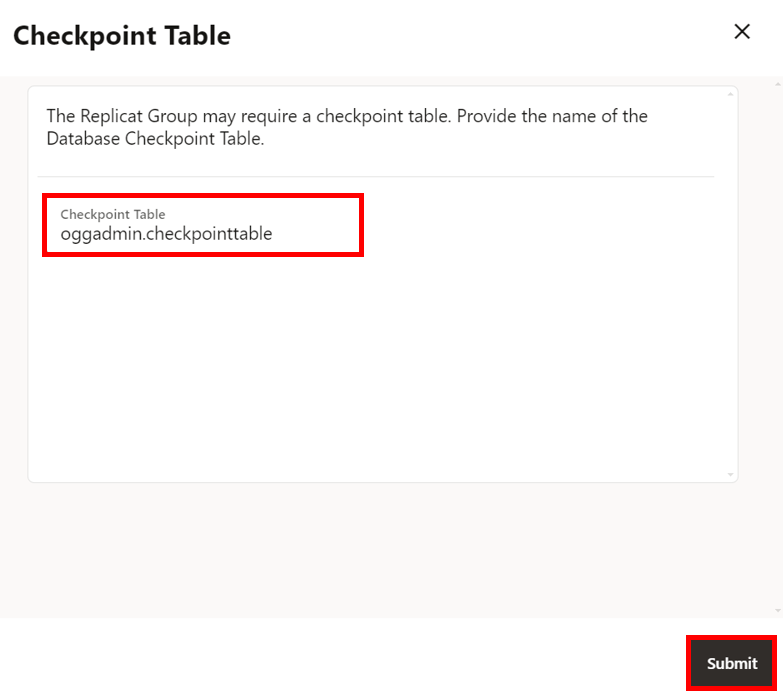

3. In the navigation menu, click **Trandata**.

    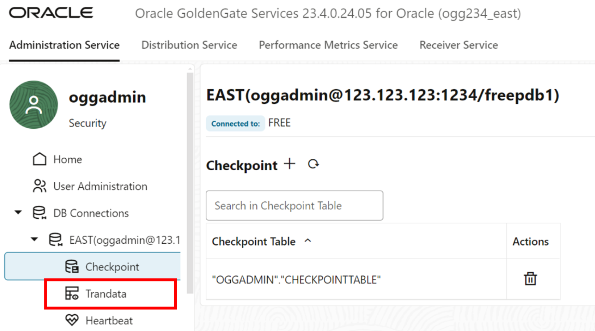

4. Click **Add TRANDATA** (plus icon).

    

5. A Trandata panel appears. For Schema Name, enter **HR**. Click **Submit**.

    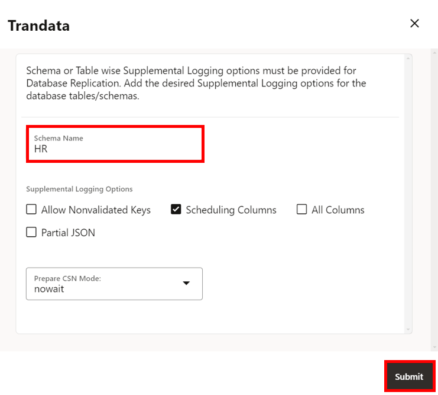

6. To verify, enter **HR** into the Search field and click Search.

    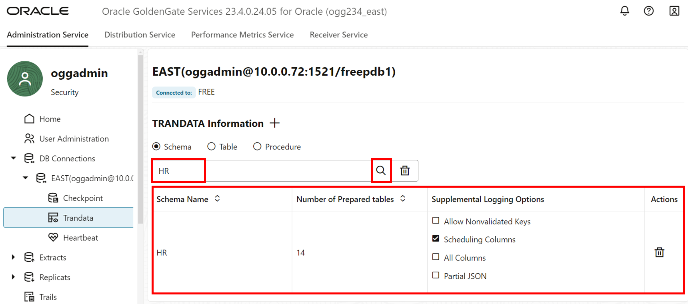

7. In the navigation menu, click **Heartbeat**. Click **Add Heartbeat** (plus icon).

    

8. An Add Heartbeat Table panel appears. Keeps the fields as is and click **Submit**.

    

## Task 3: Add a custom-managed profile

1. In the navigation menu, click **Managed Process Profiles**.

2. Click **Add Profile** (plus icon).

    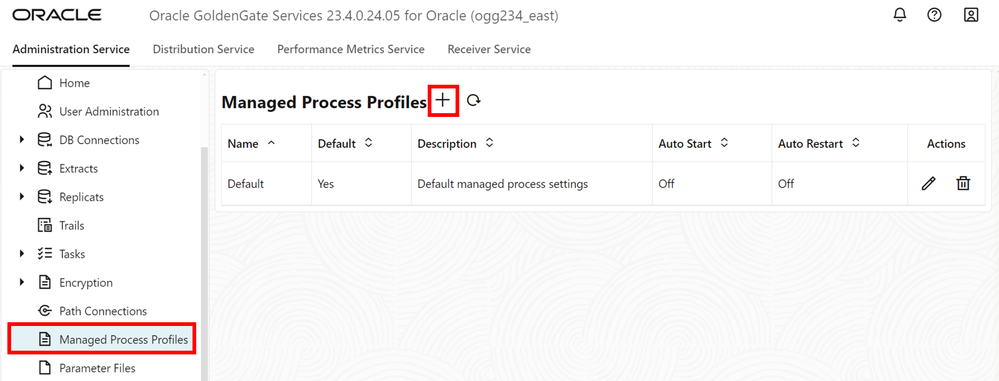

3. An Add Managed Process Settings Profile panel appears, complete the following fields, and then click **Submit**: 
    * For Profile Name, enter **east-profile**.
    * Enable **Default Profile** toggle.
    * Enable **Auto Start** toggle.
    * Enable **Auto Restart** toggle.

    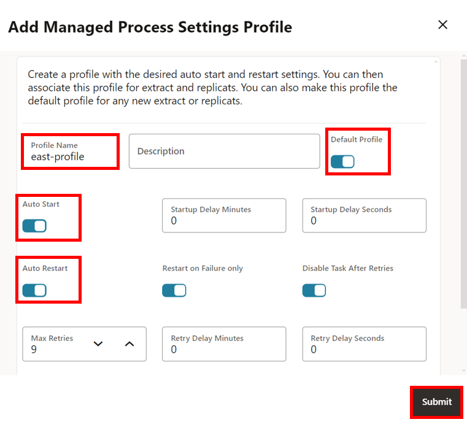

Keep the **East** WebUI console open.

## Task 4: Add DB connection to West database

1. On the Reservation Information page, click on the **ogg\_west\_url** link to access the Oracle GoldenGate West 23ai Microservices WebUI console.

2. To log in to the Oracle GoldenGate West 23ai Microservices WebUI console, enter **oggadmin** for Username and the Password, and then click **Sign In**. 

    > **NOTE:** If using the LiveLab Sandbox environment, copy the deployment password from the Terraform output section of **View Login Info**.

    

    After you log in successfully, you're brought to the Oracle GoldenGate 23ai deployment console home page. Here, you can access the GoldenGate Administration, Performance Metrics, Distribution, and Receiver Services, as well as add Extracts and Replicats for your data replication tasks.

3. In the navigation menu and click **DB Connections**.

    

4. Click **Add DB Connection** (plus icon).

    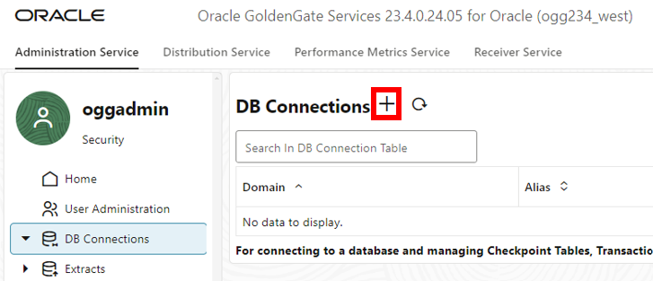

5. A Credentials panel will appear, complete the following fields, and then click **Submit**:
    * For Credential Alias, enter **WEST**.
    * For User ID, paste the **db\_west\_private\_connection** value from the Reservation Information. 
    * For Password, paste the **Global Password** from the Reservation Information. Verify the password. 

    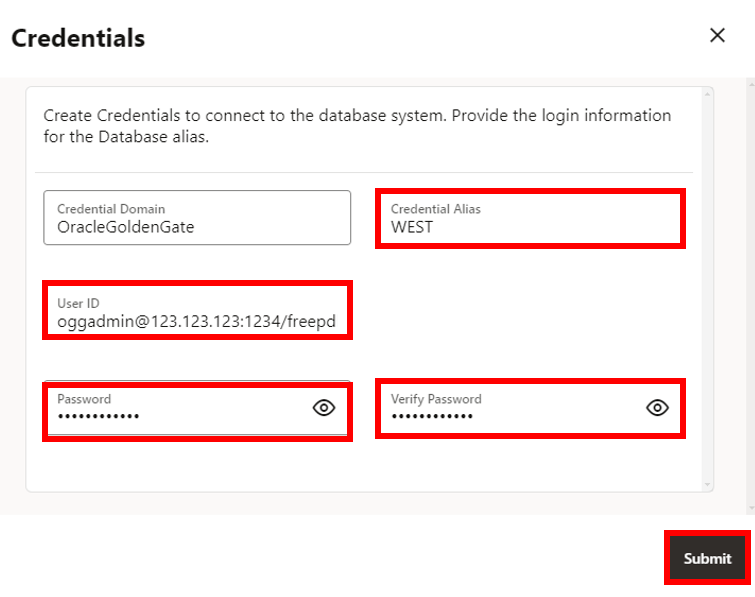

6. Click **Connect to database**. If successful, you are directed to the Checkpoint page. 

    

7. Repeat task 2 above to create a new Checkpoint table, Trandata information, and Heartbeat table. 

8. Repeat task 3 above to create a Managed Process Profile for **west-profile**.

Keep the **West** WebUI console open.

You may now **proceed to the next lab.**

## Learn more

* [Add Database Connections](https://docs.oracle.com/en/middleware/goldengate/core/23/coredoc/extract-add-and-alter-database-connections.html#GUID-45112AEE-19[…]3AE-18571BFA831B)

## Acknowledgements
* **Author** - Katherine Wardhana, User Assistance Developer
* **Contributors** -  Alex Lima, Database Product Management
* **Last Updated By/Date** - Katherine Wardhana, August 2024