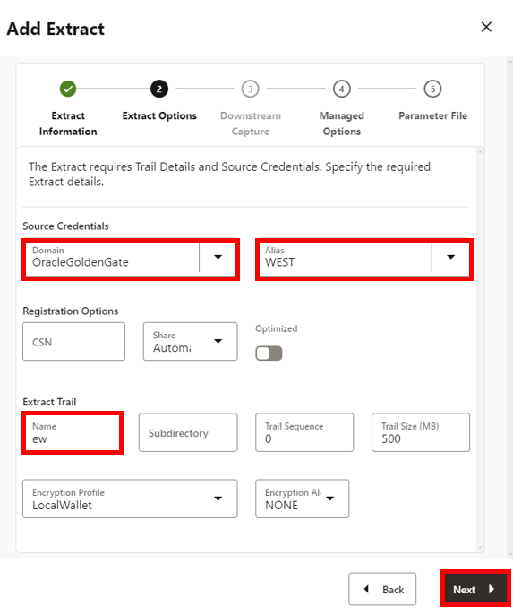
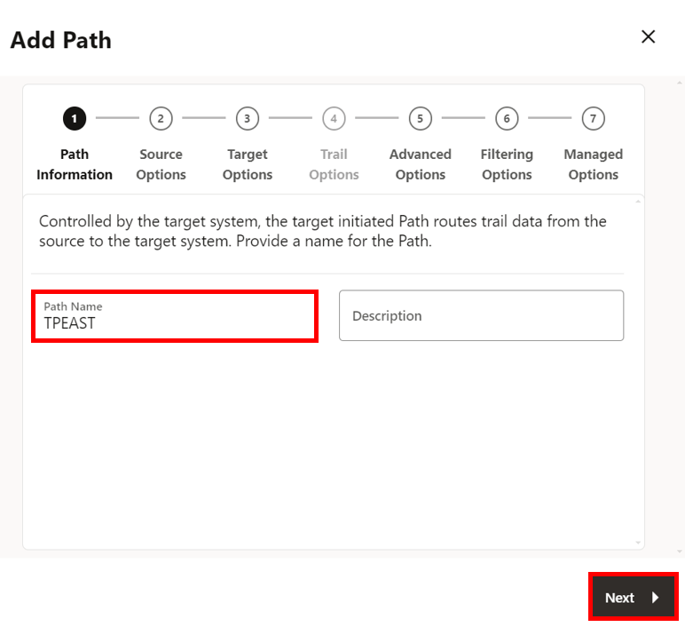
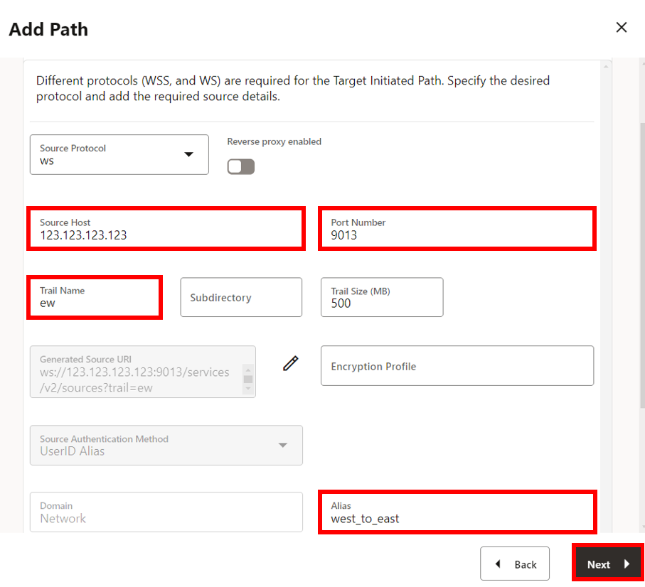
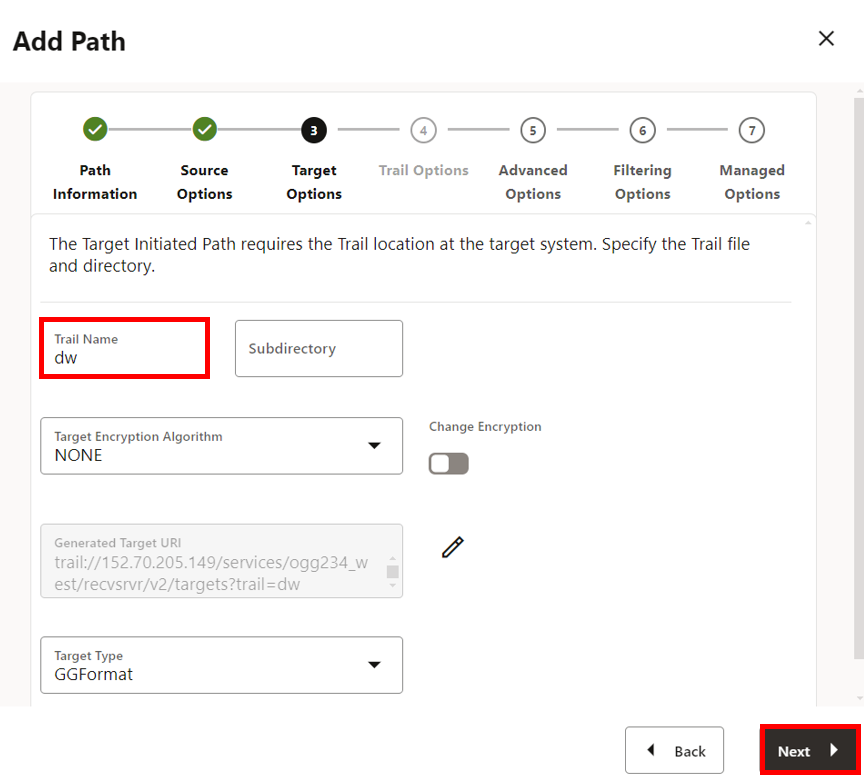
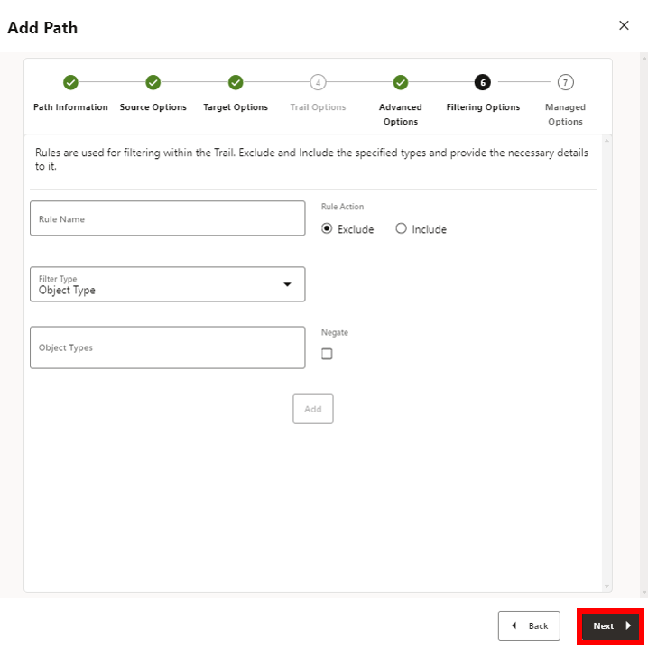
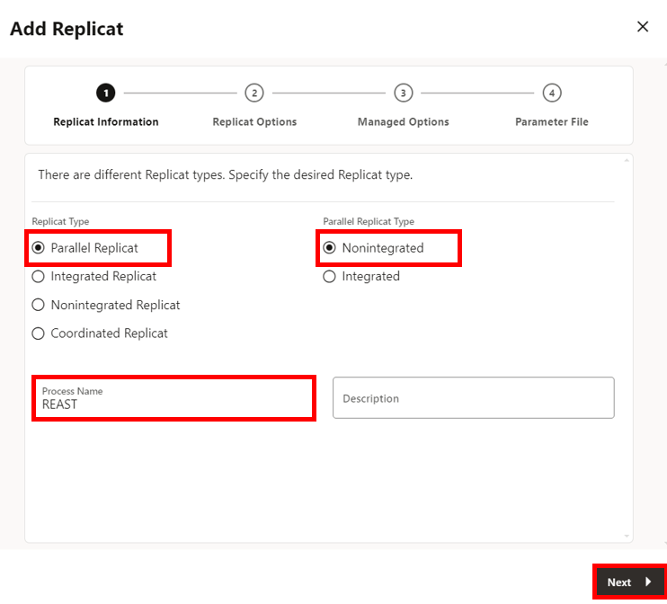
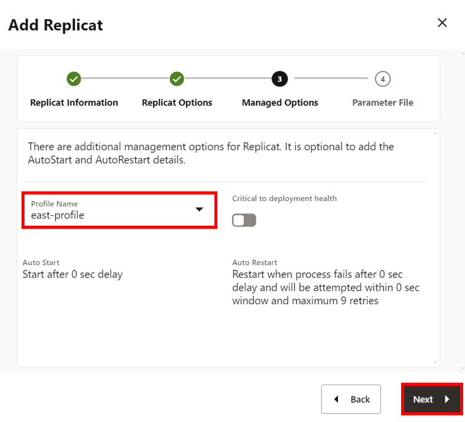
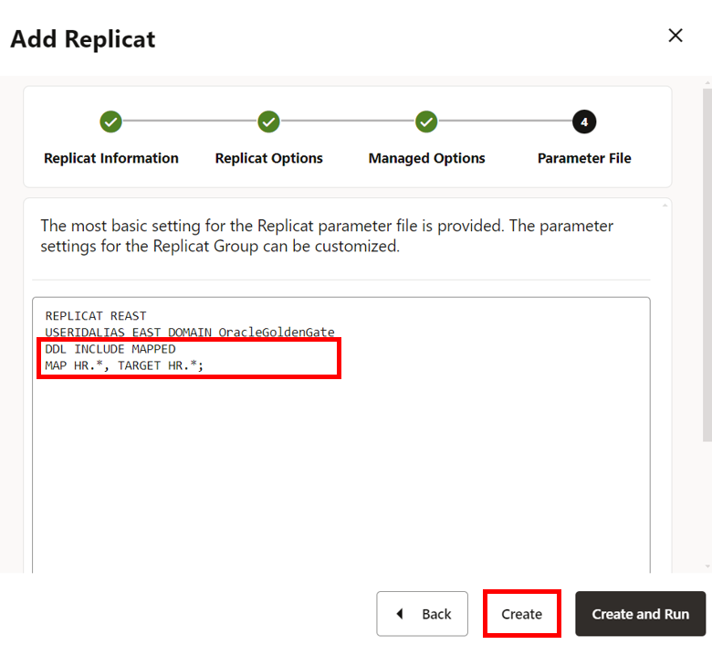

# Replicate data from West to East

## Introduction

This lab walks you through the steps create and run an Extract, add a User Administrator, create a Path Connection, create and run a Target-Initiated Path, and create and run a Replicat.

Estimated time: 20 minutes

### About Extracts, Target-Initiated Paths, and Replicats

An Extract is a process that extracts or captures data from a source database. A Target-initiated path enables the Receiver Service to initiate a path to the Distribution Service on the target deployment and pull trail files. A Replicat is a process that delivers data to a target database.

### About User Administrators

Authorization in Oracle GoldenGate relies on user roles. As a User Administrator, you can choose and assign various user roles when creating Oracle GoldenGate users. These roles include a User, an Operator, an Administrator, and a Security.

### About a Path Connection

A Path Connection creates Credentials for the DistPath to connect to a GoldenGate Deployment. You will need to provide the login information for the GoldenGate alias. 

### Objectives

In this lab, you will:
* Add and run an Extract process to capture data
* Create a Path Connections
* Create a new User Administrator
* Add and run a Target-Initiated Path to pull trail files
* Add and run a Replicat process to consume the trail file received from the East database

## Task 1:  Add and run an Extract

1. Make sure you're on the the **West** Microservices WebUI. In the navigation menu, click **Extracts**.

2. Click **Add Extract** (plus icon).

    

3. The Add Extract panel consists of five pages. On the Extract information page, complete the following fields, and then click **Next**:
    * For Extract Type, select **Integrated Extract**.
    * For Process Name, enter **EWEST** and optionally, a description.

    

4. On the Extract Options page, complete the following fields, and then click **Next**: 
    * For Domain, select **OracleGoldenGate** from the dropdown.
    * For Alias, select **WEST** from the dropdown.
    * For Name, enter **ew**.

    

5. On the Managed Options page, for Profile Name, select **west-profile** from the dropdown, and then click **Next**.

    

6. On the Parameter File page, in the text area, add a new line to the existing text and add the following:

    ```
    <copy>TRANLOGOPTIONS EXCLUDETAG 00
    DDL INCLUDE MAPPED
    table HR.*;</copy>
    ```

7. Click **Create**. 

    

8. In the EWEST **Action** menu, select **Start**. In the Confirm Action dialog, click **OK**. 

    

## Task 2: Add a Path Connection
A Path Connection creates Credentials for the Distribution Path to connect to a database. The Credential Alias contains the target user ID and password.

1. In the navigation menu, click **Path Connections**, and then Click **Add Path Connection** (plus icon).

    

2. A Path Connection panel appears, complete the following fields, and then click **Submit**:  
    * For Credential Alias, enter **west\_to\_east**.
    * For User ID, enter **oggnet-east**.
    * For password, paste the Global Password from the Reservation Information. Verify the password. 

    

3. The path connection you created appears in the Path Connections list.

    

## Task 3: Add an East Oracle GoldenGate user
The User performs operational actions required to create and run the Distribution Path. Operational actions include creating, starting, and stopping resources.

1. Switch to the **East** Microservices WebUI.

2. Open the navigation menu and then click **User Administration**.

3. Click **Add New User** (plus icon). 

    

4. A Create new User pop up will appear, complete the following fields, and then click **Submit**:  
    * For the Authenticated By dropdown, select **Password**.
    * For the Role dropdown, select **Operator**.
    * For Info, enter **Target-Initiated path user**.
    * For Username, enter **oggnet-east**.
    * For password, paste the Global Password from the Reservation Information. Verify the password. 

    

5. The user you created appears in the Users list.

    

## Task 4: Add a Target-Initiated Path on East Oracle GoldenGate

1. On the top navigation menu, click **Receiver Service**, and then click **Add Target-Initiated Path** (plus icon). 

    

2. The Add Path panel consists of seven pages. On the Path Information page, for Name, enter **TPEAST**, and then click **Next**.

    

3. On the Source Options page, complete the following fields, and then click **Next**:
    * For Source Host, paste the **ogg-west-public\_ip** value from the Reservation Information.
    * For Port Number, enter **9013**.
    * For Trail Name, enter **ew**.
    * For For Alias, enter **west\_to\_east**.

    

4. On the Target Options page, for Trail Name, enter **dw**, and then click **Next**.

    

5. On the Advanced Options page, leave the fields as is, and click **Next**.

    

6. On the Filtering Options page, leave the fields as is, and click **Next**.

    

7. On the Managed Options page, leave the fields as is, and click **Create Path**.

    

8. On the left hand navigation menu, click **Target-Initiated Paths**.

9. In the TPEAST **Action** menu, select **Start**. In the Confirm Action dialog, click **OK**.

    

## Task 5: Add a Replicat on East deployment

1. Open the top navigation menu, click **Administration Service**. Click **Add Replicat** (plus icon).

    

2. The Add Replicat panel consists of four pages. On the Replicat Information page, complete the following fields, and then click **Next**:
    * For Replicat Type, select **Parallel Replicat**.
    * For Parallel Replicat Type, select **Nonintegrated**.
    * For Process Name, enter **REAST**.

    

3. On the Replicat Options page, complete the following fields, and then click **Next**:
    * For Replicat Trail, enter **dw**.
    * For Domain, select **OracleGoldenGate** from the dropdown.
    * For Alias, select **EAST** from the dropdown.
    * For Checkpoint Table, select **"OGGADMIN"."CHECKPOINTTABLE"** from the dropdown.

    

4. On the Managed Options page, for Profile Name, select **east-profile** from the dropdown.

    

5. On the Parameter File page, page, in the text area, replace **MAP *\.\*, TARGET \*.\*;** with the following script:

    ```
    <copy>DDL INCLUDE MAPPED
    MAP HR.*, TARGET HR.*;</copy>
    ```
6. Click **Create**.

    

7. In the navigation menu, click **Replicats**.

8. In the REAST **Action** menu, select **Start**. In the Confirm Action dialog, click **OK**. 

    

You may now **proceed to the next lab.**

## Learn more

* [Before Adding Extract and Replicat Processes](https://docs.oracle.com/en/middleware/goldengate/core/23/coredoc/configure-ogg-adding-extract-and-replicat.html#GUID-C1044A4D-945E-4080-B79C-74FA9D004143)
* [Registering Extract for Oracle](https://docs.oracle.com/en/middleware/goldengate/core/23/coredoc/extract-oracle-registering-extract.html)
* [Access Extract Details](https://docs.oracle.com/en/middleware/goldengate/core/23/coredoc/extract-access-extract-details.html)
* [About Target-Initiated Distribution Paths](https://docs.oracle.com/en/middleware/goldengate/core/23/coredoc/distribute-target-initiated-distribution-paths.html)
* [About Replicat](https://docs.oracle.com/en/middleware/goldengate/core/23/coredoc/replicat-replicat.html)

## Acknowledgements
* **Author** - Katherine Wardhana, User Assistance Developer
* **Contributors** -  Alex Lima, Database Product Management
* **Last Updated By/Date** - Katherine Wardhana, July 2024
