# Create MySQL Extracts

## Introduction

This lab walks you through the steps to create Extracts and Distribution Paths on the source MySQL deployment.

Estimated time: 30 minutes

### About Extracts and Distribution Paths

An Extract is a process that extracts, or captures, data from a source database. A Distribution Path is a source-to-destination configuration that uses the Distribution Server to send data to a target deployment in a distributed environment.

### Objectives

In this lab, you will:
* Create an Initial Load Extract
* Create a Distribution Path for the Initial Load Extract
* Create a Integrated Extract
* Create a Distribution Path for the Integrated Extract

### Prerequisites

To successfully complete this lab, you need:
* Both the source and target deployments are in the Active state
* The oggadmin password for the source MySQL OCI GoldenGate deployment (Lab 1, Task 1, Step 15)
* The oggadmin password for the target ADW OCI GoldenGate deployment (Lab 1, Task 2, Step 11)

## Task 1: Create the Integrated Extract

1.  On the Deployments page, select the source MySQL deployment to view its details.

2.  On the Deployment details page, click **Launch console**.

    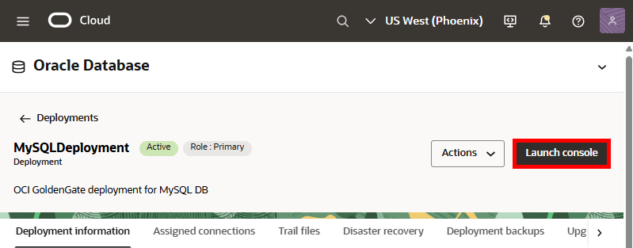

3.  To log in to the GoldenGate deployment console, enter **oggadmin** for User name, enter the password, and then click **Sign In**. 

    

    > **NOTE:** If using the LiveLab Sandbox environment, copy the OCI GoldenGate Admin Password from the Terraform output section of **View Login Info**.

    

    

    After you log in successfully, you're brought to the GoldenGate 23ai deployment console home page. Here, you can access the GoldenGate Administration, Distribution and Receiver Services, Performance Metrics Service, as well as add Extracts and Replicats for your data replication tasks.

    

4.  Open the navigation menu, and then click **DB Connections**.

    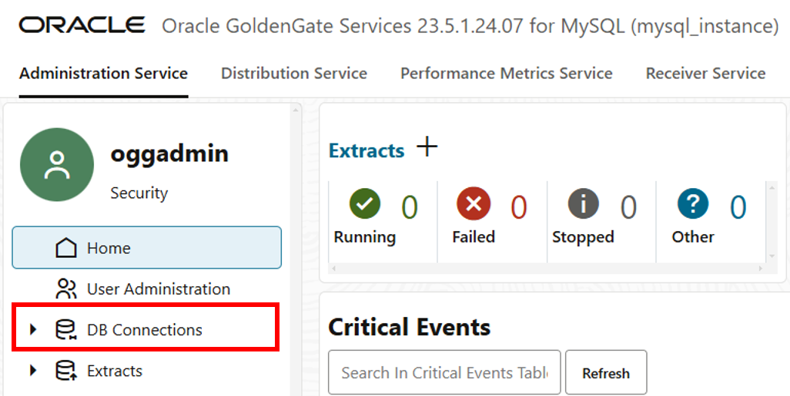

5.  On the Credentials page, locate **SourceMySQL**, and then take note of its **Domain** and **Alias**.

    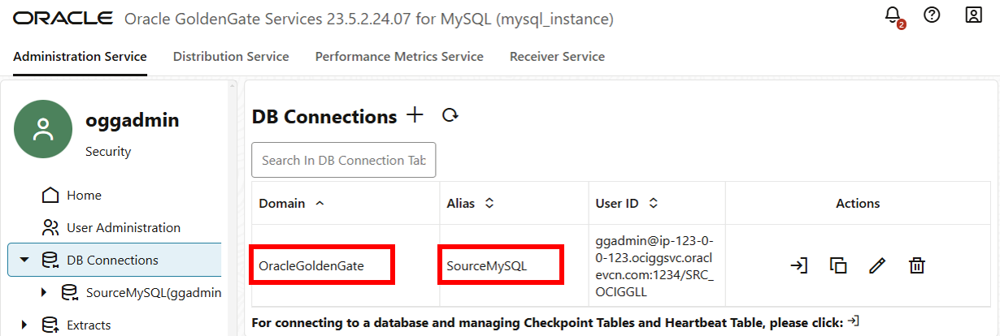

6.  In the Action column for the SourceMySQL database, Click **Connect to database SourceMySQL** to test the connection.

    

    If the connection is successful, then Checkpoint and Heartbeat appear. If the connection is unsuccessful, return to the MySQL connection in the Oracle Cloud console to review the connection settings.

7.  On the Home page, click **Add Extract** (plus icon).

    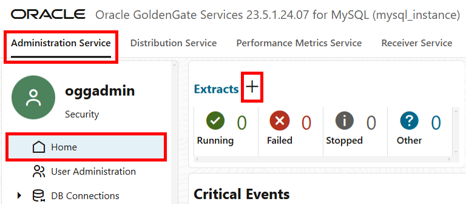

8. In the Add Extract panel, on the Extract Information page, for **Extract Type**, select **Integrated Extract**.

9. For **Process Name**, enter `CDCEXT`, and then click **Next**.

    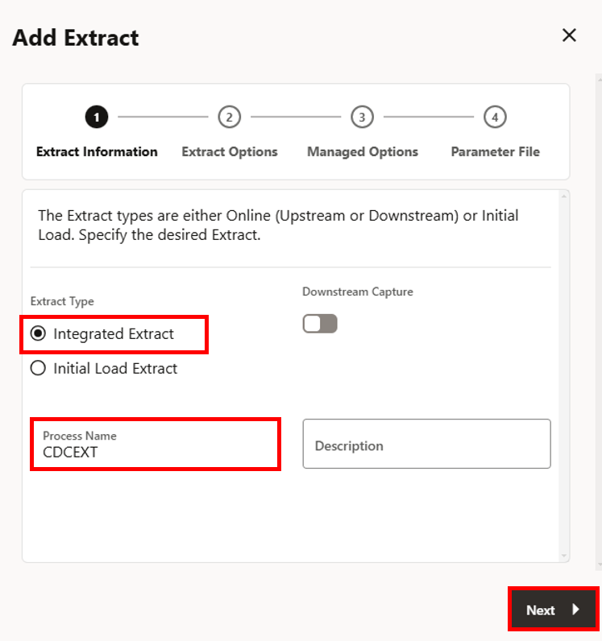

10. On the Extract Options page, for Source Credentials **Domain**, select **OracleGoldenGate**, and for **Alias**, select **SourceATP**.

11. For Extract Trail **Name**, enter `C1`, and then click **Next**.

    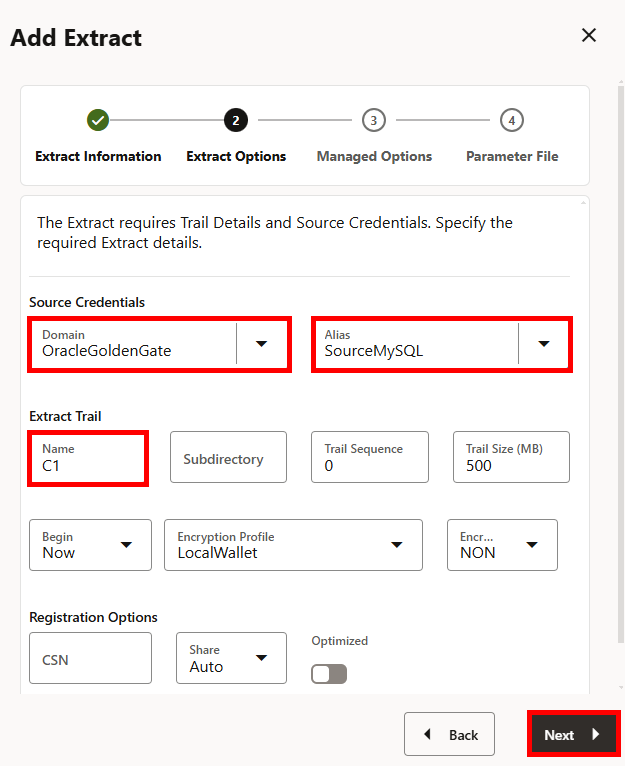

12. On the Managed Options page, leave the fields as they are, and then click **Next**.

    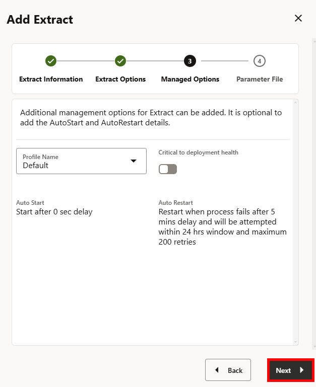

13. On the Parameter File page, in the text area, add a new line to the existing text, add the following, and then click **Create and Run**:

    ```
    <copy>TABLE SRC_OCIGGLL.*;</copy>
    ```

    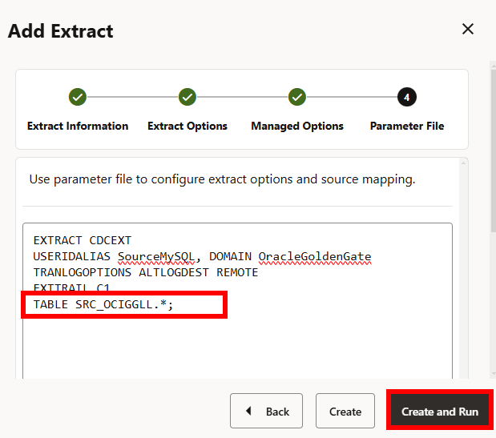

    You return to the Administration Service Overview page where you can observe the CDCEXT process starting.

    The status updates to Running.

    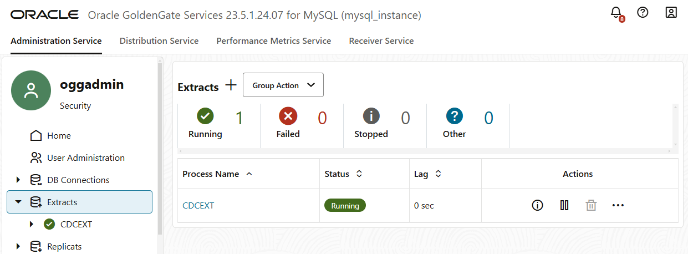

## Task 2: Create the Initial Load Extract

1.  In the navigation menu, click **Overview**.

2.  On the Overview page, click **Add Extract** (plus icon)

    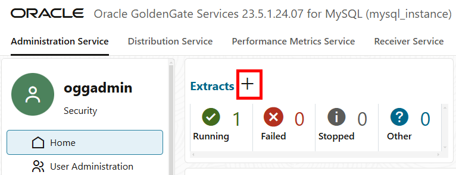

3.  In the Add Extract panel, on the Extract Information page, for **Extract Type**, select **Initial Load Extract**.

4. For **Process Name**, enter `ILEXT`, and then click **Next**.

    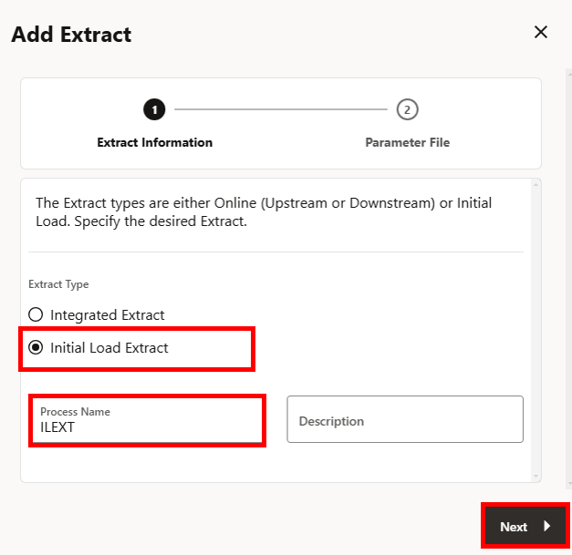

5.  On the Parameter File page, in the text area, add a new line to the existing text, add the following, and then click **Create and Run**:

    ```
    <copy>TABLE SRC_OCIGGLL.*;</copy>
    ```

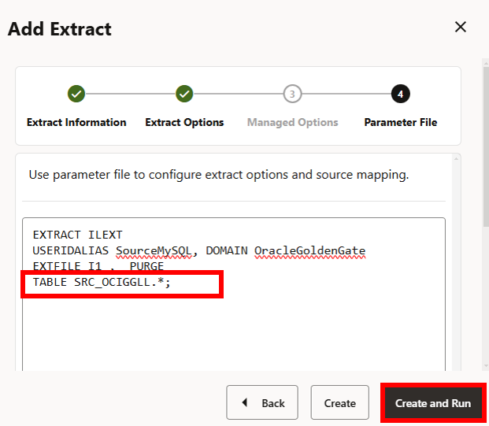

    You return to the Administration Service Overview page where you can observe the ILEXT process starting.

    The status updates to Running.

## Task 3: Create an OCI GoldenGate user for the Distribution Paths
In this task, you create a user in the target deployment for the Distribution Paths to use to send data.

1.  In the Oracle Cloud console, on the **Deployments** page, select the target Autonomous Data Warehouse deployment to view its details.

2.  On the deployment details page, click **Launch console**.

3.  On the OCI GoldenGate deployment console sign in page, enter `oggadmin` for User Name, enter the password, and then click **Sign In**.

    

    > **NOTE:** If using the LiveLab Sandbox environment, copy the OCI GoldenGate Admin Password from the Terraform output section of **View Login Info**.

4.  Open the navigation menu, and then click **User Administration**.

5.  Click **Add New User** (plus icon).

    

6.  Complete the fields as follows, and then click **Submit**:
    * For **Aythenticated By**, select **Password**.
    * For **Role**, select **Operator**.
    * For **Username**, enter `ggsnet`.
    * Enter a password for this user, and then enter it again for verification.

    

    The ggsnet user appears in the Users list.

7.  In the source MySQL OCI GoldenGate deployment console, open the navigation menu and then click **DB Connections**.

8.  On the DB Connections page, click **Add Credential** (plus icon).

9.  Complete the fields as follows, and then click Submit:
    * For **Credential Domain**, enter `GGSNetwork`.
    * For **Credential Alias**, enter `dpuser`.
    * For **User ID**, enter `ggsnet`.
    * For **Password**, enter the password from Step 6.

    

    The credential appears in the Credentials list.

## Task 4: Create the Distribution Path for the Initial Load Extract

1.  In the source MySQL OCI GoldenGate deployment console, click **Distribution Service**.

2.  On the Distribution Service Overview page, click **Add Distribution Path** (plus icon).

    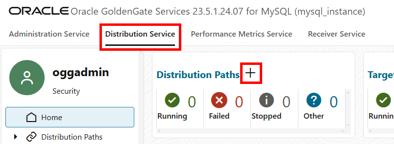

3. The Add Path panel consists of seven pages. On the Path Information page, for **Name**, enter `ILDP`, and then click **Next**.

  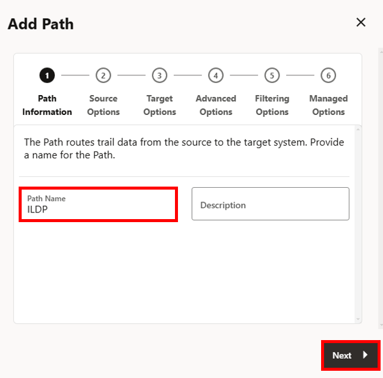

4. On the Source Options page, complete the following fields, and then click **Next**:

    * For **Source Extract**, select **CDCEXT** from the dropdown.
    * For **Trail Name**, `I1` should automatically populate the field.

  

5. On the Target Options page, complete the following fields, and then click **Next**:

    * For **Target Host**, enter the target ADW OCI GoldenGate deployment console URL, without the https:// or any trailing slashes. You can copy the console URL from the ADWDeployment details page.

    

    * For **Port Number**, enter **443**.
    * For **Trail Name**, enter `C1`.
    * For **Alias**, enter **dpuser**.

    

6. On the Advanced Options page, leave the fields as they are, and click **Next**.

    

7. On the Filtering Options page, leave the fields as they are, and click **Next**.

    

8. On the Managed Options page, leave the fields as they are, and click **Create Path and Run**.

    

    You return to the Distribution Service Overview page where you can review the path created.

4.  In the target ADW OCI GoldenGate deployment console (**adw_instance**), click **Receiver Service** to review the Receiver Path created as a result of creating the `ILDP` Distribution Path.

    

## Task 5: Create the Distribution Path for the Change Data Capture Extract

1.  In the source MySQL OCI GoldenGate deployment console, click **Distribution Service**.

2.  On the Distribution Service Overview page, click **Add Path** (plus icon).

    

3. The Add Path panel consists of seven pages. On the Path Information page, for **Name**, enter `CDCDP`, and then click **Next**.

  

4. On the Source Options page, complete the following fields, and then click **Next**:

    * For **Source Extract**, select **CDCEXT** from the dropdown.
    * For **Trail Name**, `C1` should automatically populate the field.

  

5. On the Target Options page, complete the following fields, and then click **Next**:

    * For **Target Host**, enter the target ADW OCI GoldenGate deployment console URL, without the https:// or any trailing slashes. You can copy the console URL from the ADWDeployment details page.

    

    * For **Port Number**, enter **443**.
    * For **Trail Name**, enter `I1`.
    * For **Alias**, enter **dpuser**.

    

6. On the Advanced Options page, leave the fields as they are, and click **Next**.

    

7. On the Filtering Options page, leave the fields as they are, and click **Next**.

    

8. On the Managed Options page, leave the fields as they are, and click **Create Path and Run**.

    

    You return to the Distribution Service Overview page where you can review the path created.

4.  In the target ADW OCI GoldenGate deployment console, click Receiver Service to review the Receiver Path created as a result of creating the `CDCDP` Distribution Path.

    

## Learn more

* [Explore the OCI GoldenGate deployment console](https://docs.oracle.com/en/cloud/paas/goldengate-service/jbkyg/index.html)
* [Add an Extract for MySQL](https://docs.oracle.com/en/cloud/paas/goldengate-service/ufidx/index.html)
* [Add a Distribution Path](https://docs.oracle.com/en/cloud/paas/goldengate-service/adpen/index.html)

## Acknowledgements
* **Author** - Jenny Chan, Consulting User Assistance Developer, Database User Assistance
* **Contributors** -  Julien Testut, Database Product Management
* **Last Updated By/Date** - Katherine Wardgaba, February 2025
