# Create the Oracle Cloud Infrastructure GoldenGate resources

## Introduction

This lab walks you through the steps to create an Oracle Cloud Infrastructure (OCI) GoldenGate deployment.

Estimated time: 20 minutes

### About Oracle Cloud Infrastructure GoldenGate Deployments and Database Registrations

A Oracle Cloud Infrastructure GoldenGate deployment manages the resources it requires to function. The GoldenGate deployment also lets you access the GoldenGate deployment console, where you can access the OCI GoldenGate deployment console to create and manage processes such as Extracts and Replicats.

Database Registrations capture source and target credential information. A database registration also enables networking between the Oracle Cloud Infrastructure (OCI) GoldenGate service tenancy virtual cloud network (VCN) and your tenancy VCN using a private endpoint.

### Objectives

In this lab, you will:
* Locate Oracle Cloud Infrastructure GoldenGate in the Console
* Create a OCI GoldenGate deployment
* Register the source and target databases


## Task 1: Create a deployment

> **Note:** *Compartment names in the screenshots may differ from values that appear in your environment.*

1.  Open the **Navigation Menu**, navigate to **Oracle Database**, and select **GoldenGate**.

    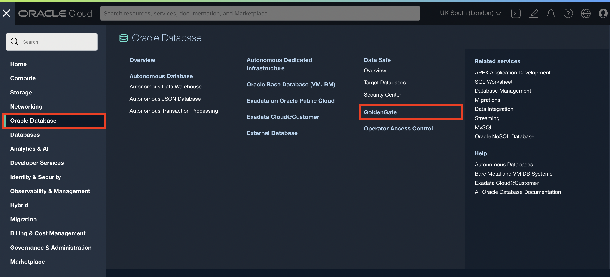

2.  On the GoldenGate **Overview** page, click **Deployments**.

    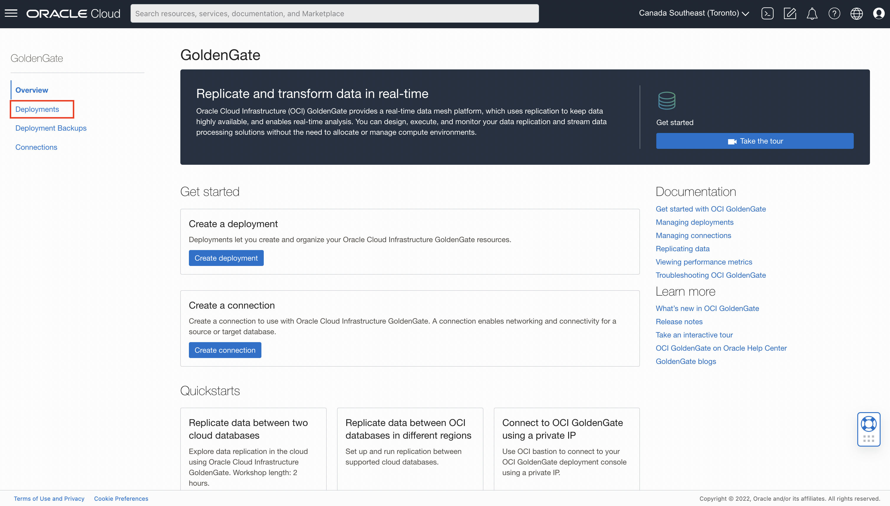

3.  You may need to select a compartment. Under List Scope, from the Comparment dropdown, expand the root compartment, and then select the compartment associated with your username. For example, if your LiveLab username is LL1234-user, expand root, expand LiveLabs, and then select the compartment **LL1234-COMPARTMENT**.

    > **Tip:** *You can find your User name in the Workshop Details section.*

4.  On the Deployments page, click **Create Deployment**.

    

5.  In the Create Deployment panel, enter **GGSDeployment** for Name.

6.  From the Compartment dropdown, select a compartment.

7.  For OCPU Count, enter **1**.

8.  For Subnet, select a subnet. If you're using the workshop environment, select **&lt;user&gt;pubsubnt**.

9.  For License type, select **Bring You Own License (BYOL)**.

10. Click **Show Advanced Options**, and then select **Create Public Endpoint**.

    

11. Click **Next**.

12. For Select a technology dropdown, select **Oracle Database**.

13. For GoldenGate Instance Name, enter **ggsinstance**.

14. For Administrator Username, enter **oggadmin**.

15. For Administrator Password, enter a password. Take note of this password.

16. Click **Create**.

    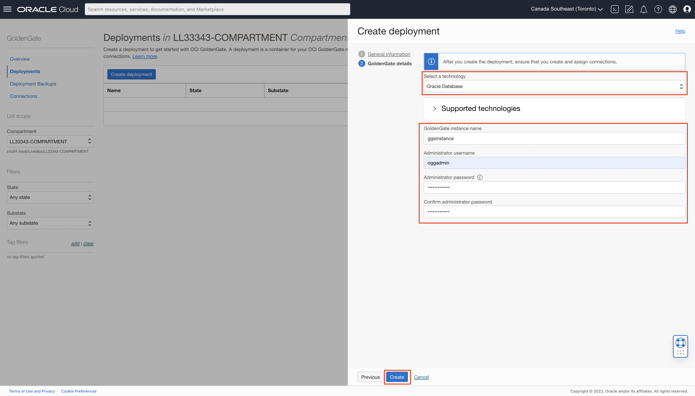

You're brought to the Deployment Details page. It takes a few minutes for the deployment to be created. Its status will change from CREATING to ACTIVE when it is ready for  you to use.

created. Its status will change from CREATING to ACTIVE when it is ready for  you to use.

## Task 2: Register the source connection

First, follow the steps below to connect the source Oracle Autonomous Transaction Processing \(ATP\) Database.

1.  Use the Oracle Cloud Console breadcrumb to navigate back to the Deployments page.

    

2.  Click **Connections**.

    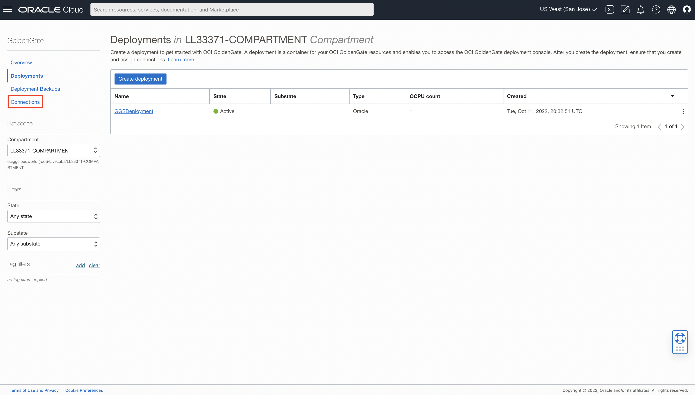

3.  Click **Create connection**.

    

4.  The Create connection panel consists of two pages. On the General information page, for Name, enter **SourceATP** and optionally, a description.

5.  From the Compartment dropdown, select a compartment.

6.  From the a Type dropdown, select **OCI Autonomous Database**.

    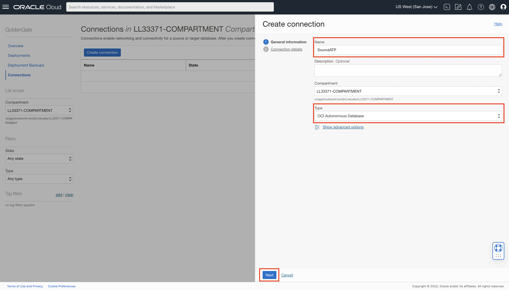

7.  Click **Next**.

8. On the Connection details page, under Database details, select **Select database**.

9.  For **Database in &lt;compartment-name&gt;**, select **SourceATP &lt;numbers&gt;** from the dropdown. 

10.  Enter the database's password in the Password field, and then click **Create**.

    

    The database registration becomes Active after a few minutes.

## Task 3: Unlock the GGADMIN user and enable supplemental logging for the source database

Oracle Autonomous Databases come with a GGADMIN user that is locked by default. The following steps guide you through how to unlock the GGADMIN user.

1.  From the Oracle Cloud Console **Navigation Menu** (hamburger icon), click **Oracle Database**, and then select **Autonomous Transaction Processing**.

	

2.  From the list of databases, select **SourceATP**.

    

3.  On the SourceATP Database Details page, click **Database Actions**.

    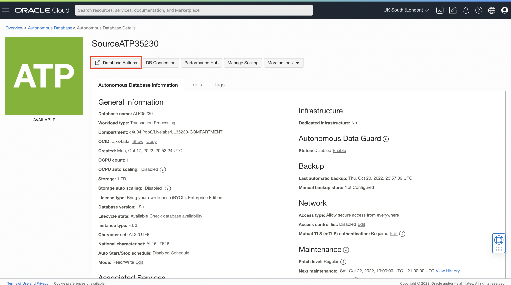

    > **Note:** *If you're prompted to log in to Database Actions, use the SourceATP admin credentials located in the Workshop Details.*

4.  Under **Administration**, click **Database Users**.

    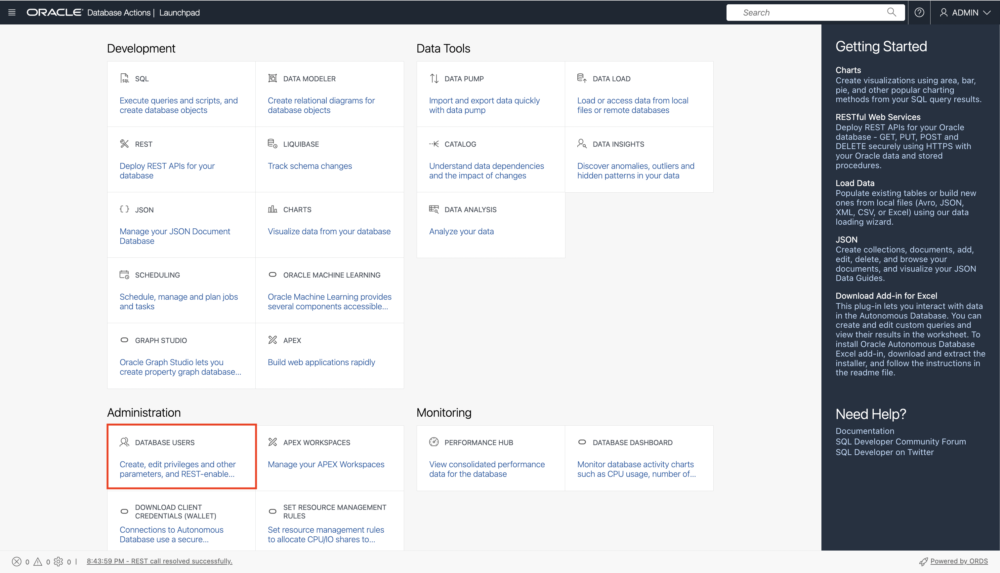

5.  From the list of users, locate **GGADMIN**, and then click the ellipsis (three dots) icon and select **Edit**.

    

6.  In the Edit User panel, deselect **Account is Locked**, enter the password you gave the ggadmin user in the database registration steps above, and then click **Apply Changes**.

    

    Note that the user icon changes from a padlock to a checkmark.

7.  Open the navigation menu (hamburger icon), and then under **Development**, select **SQL**.

    

8.  Enter the following into the Worksheet, and then click **Run Statement**.

    ```
    <copy>ALTER PLUGGABLE DATABASE ADD SUPPLEMENTAL LOG DATA;</copy>
    ```

    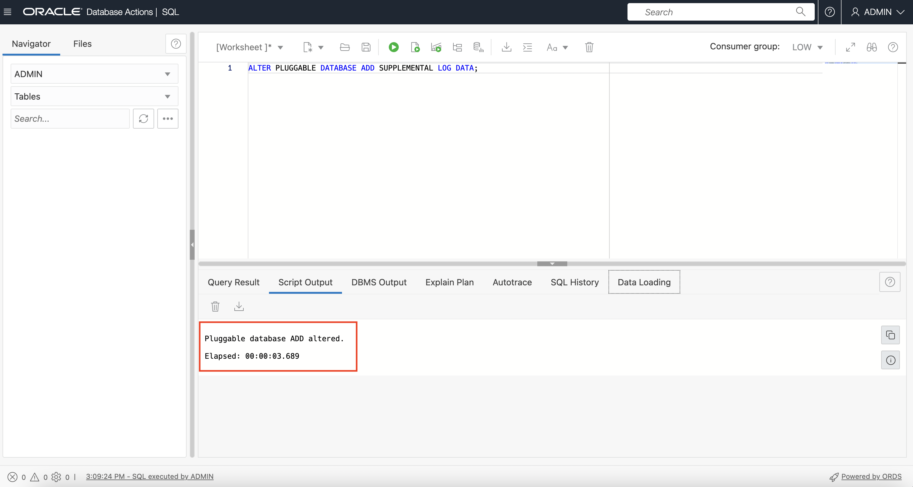

9.  Replace the supplemental logging script with the following to check support mode, and then click **Run Statement**:

    ```
    <copy>
    select * from DBA_GOLDENGATE_SUPPORT_MODE where owner = 'SRC_OCIGGLL';
    </copy>
    ```

    The Script Output panel displays six tables whose Support_Mode is **FULL**.

    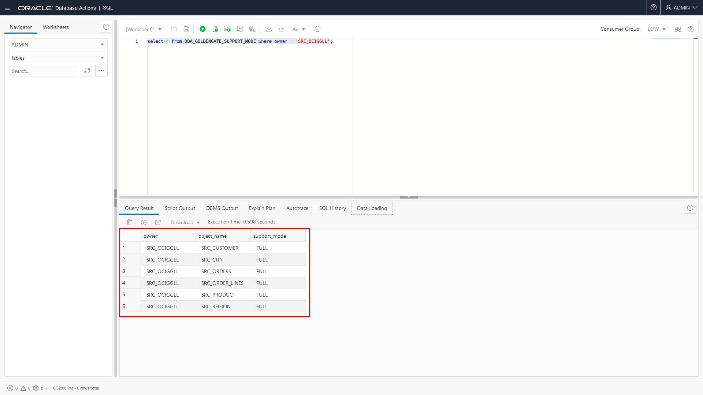

    You can leave the SQL window open and continue with the next Task.

## Task 4: Register the target database and unlock the GGADMIN user

Now, follow the steps below to connect the target Autonomous Data Warehouse \(ADW\) instance.

1.  Use the Oracle Cloud Console navigation menu to navigate back to GoldenGate.

2.  Click **Connections** and then **Create Connection**.

    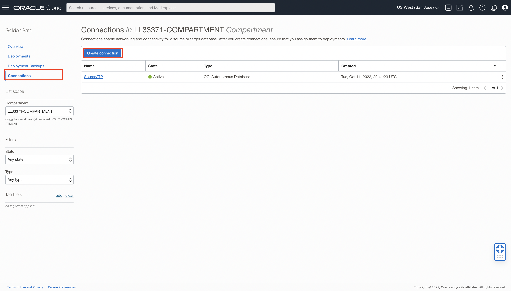

3.  The Create connection panel consists of two pages. On the General information page, for Name, enter **TargetADW** and optionally, a description.

4.  From the **Compartment** dropdown, select a compartment.

5.  From the a Type dropdown, select **OCI Autonomous Database**.

    

6.  Click **Next**.

7. On the Connection details page, under Database details, select **Select database**.

8. For **Database in &lt;compartment-name&gt;**, select **TargetATP &lt;numbers&gt;** from the dropdown. 

9. Enter the database's password in the Password field, and then click **Create**.

    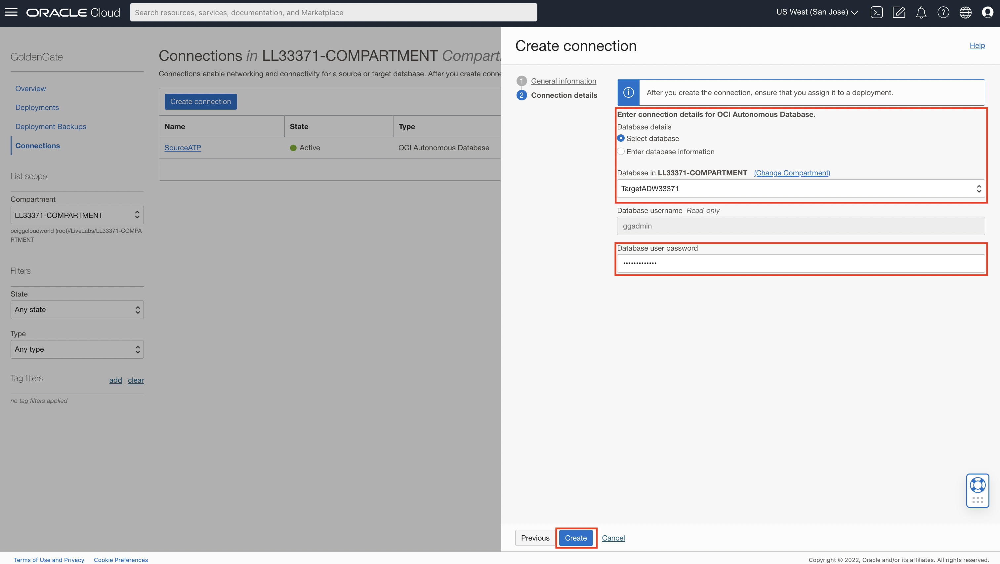

    The source and target databases appear in the list of Connections. The database registration becomes Active after a few minutes.

10.  Repeat Task 2, steps 1-8, to unlock the GGADMIN user and enable supplemental logging on the TargetADW database.

11.  Replace the supplemental logging script with the following to check support mode, and then click **Run Statement**:

    ```
    <copy>
    select * from DBA_GOLDENGATE_SUPPORT_MODE where owner = 'SRCMIRROR_OCIGGLL';
    </copy>
    ```

    The Script Output panel displays six tables whose Support_Mode is **FULL**.

    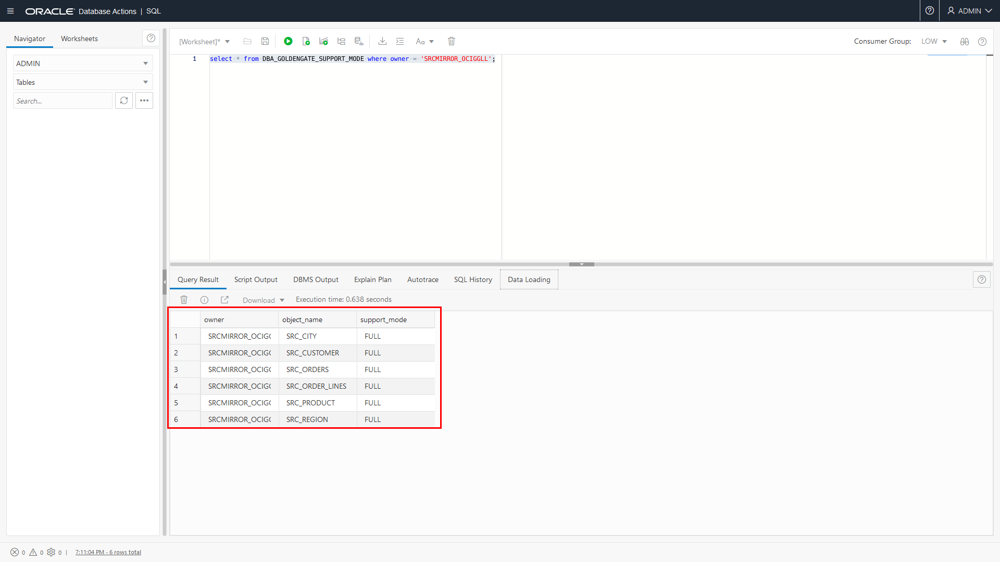


## Task 5: Review the deployment details

After the deployment is created and active, you can perform the following actions on the deployment details page:

* Review the deployment's status
* Launch the GoldenGate service deployment console
* Edit the deployment's name or description
* Stop and start the deployment
* Move the deployment to a different compartment
* Review the deployment resource information
* Add tags

    

## Task 6: Assign connections to the deployment
1. Click **Assigned connections**.

    

2. Click **Assign connection**.

    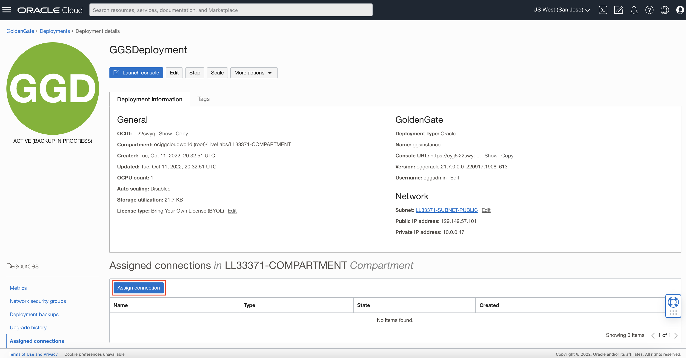

3. In the Assign connection panel, from the Connection in &lt;compartment-number&gt;-COMPARTMENT dropdown, select **SourceATP**. Click **Assign connection**.

    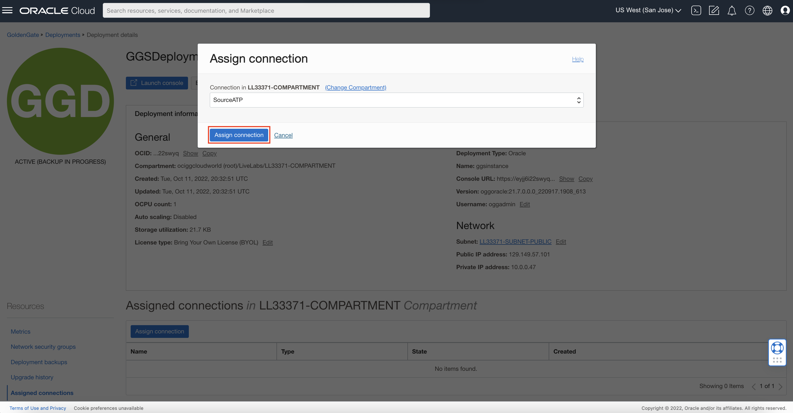

4.  Repeat Task 6, steps 1-3, to assign connection on the TargetADW database.

     

## Learn More

* [Managing deployments](https://docs.oracle.com/en/cloud/paas/goldengate-service/ebbpf/index.html#articletitle)
* [Managing connections](https://docs.oracle.com/en/cloud/paas/goldengate-service/mcjzr/index.html#articletitle)

## Acknowledgements
* **Author** - Jenny Chan, Consulting User Assistance Developer, Database User Assistance
* **Contributors** -  Denis Gray, Database Product Management & Katherine Wardhana, User Assistance Developer
* **Last Updated By/Date** - Katherine Wardhana, October 2022
