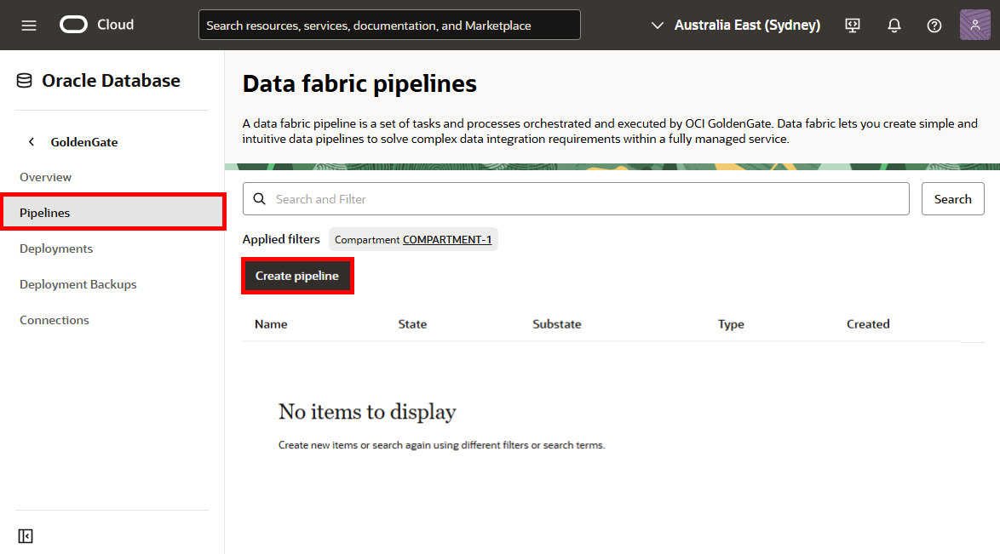
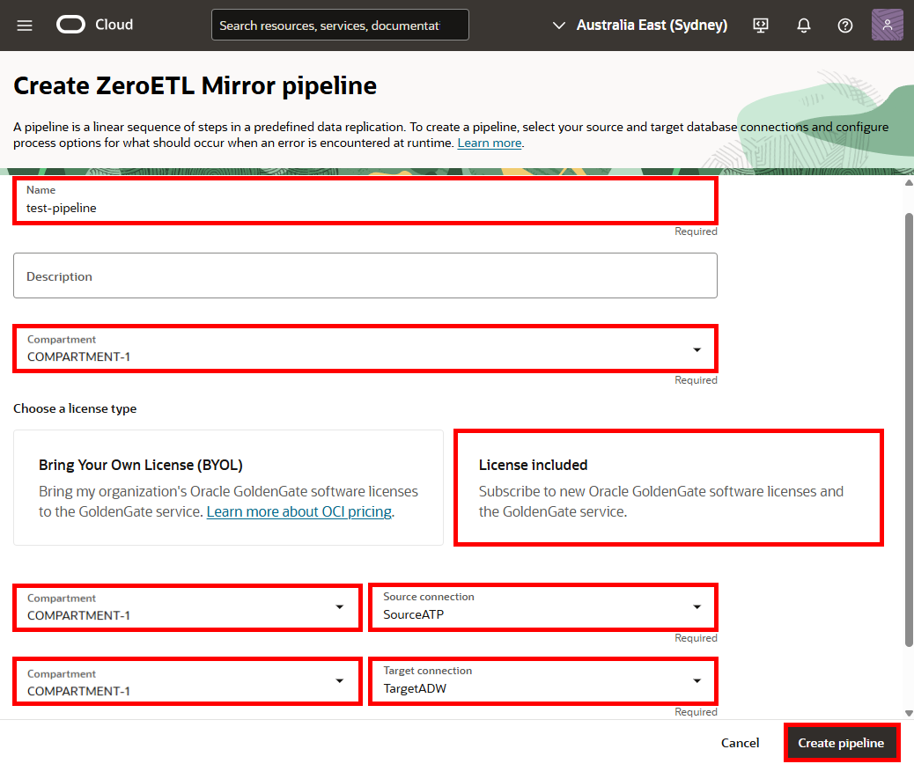
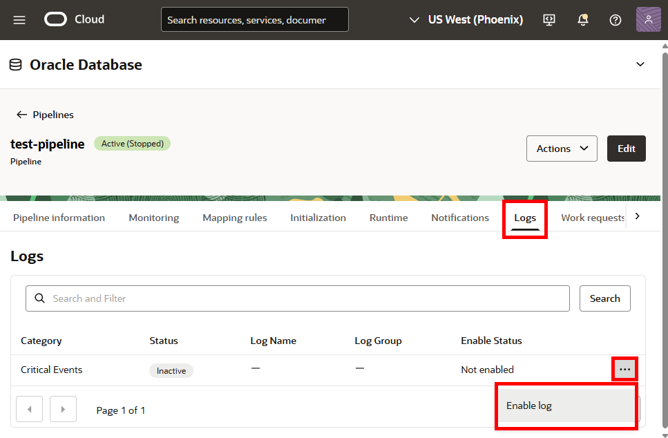
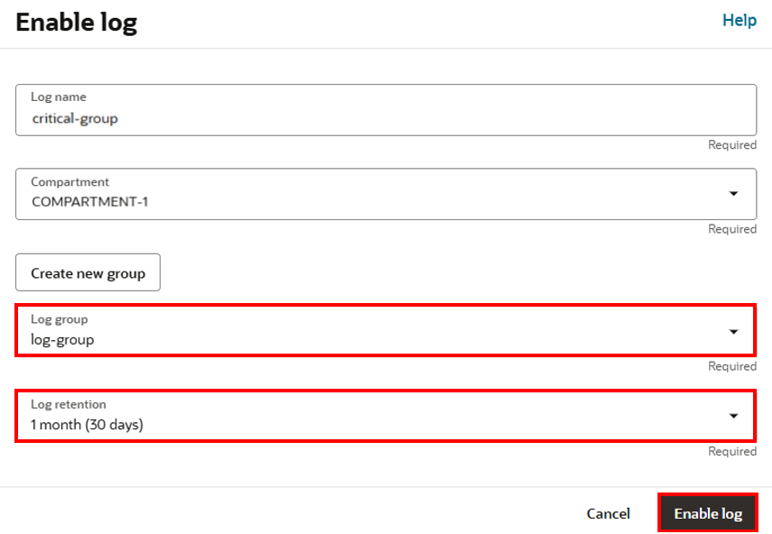
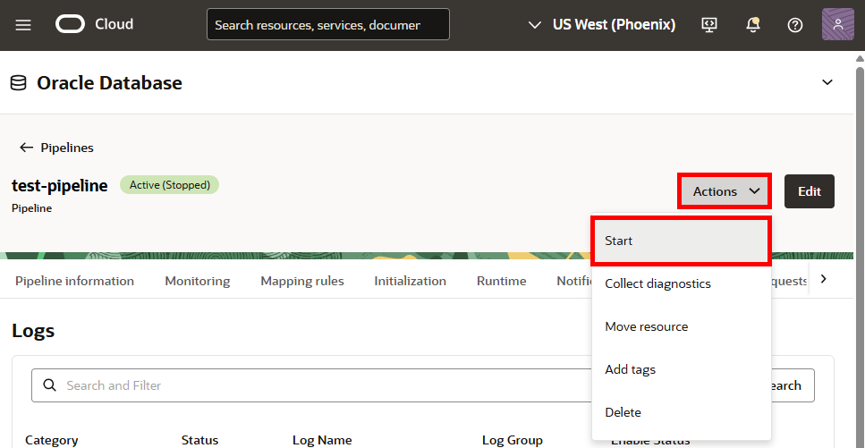
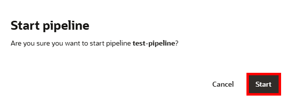
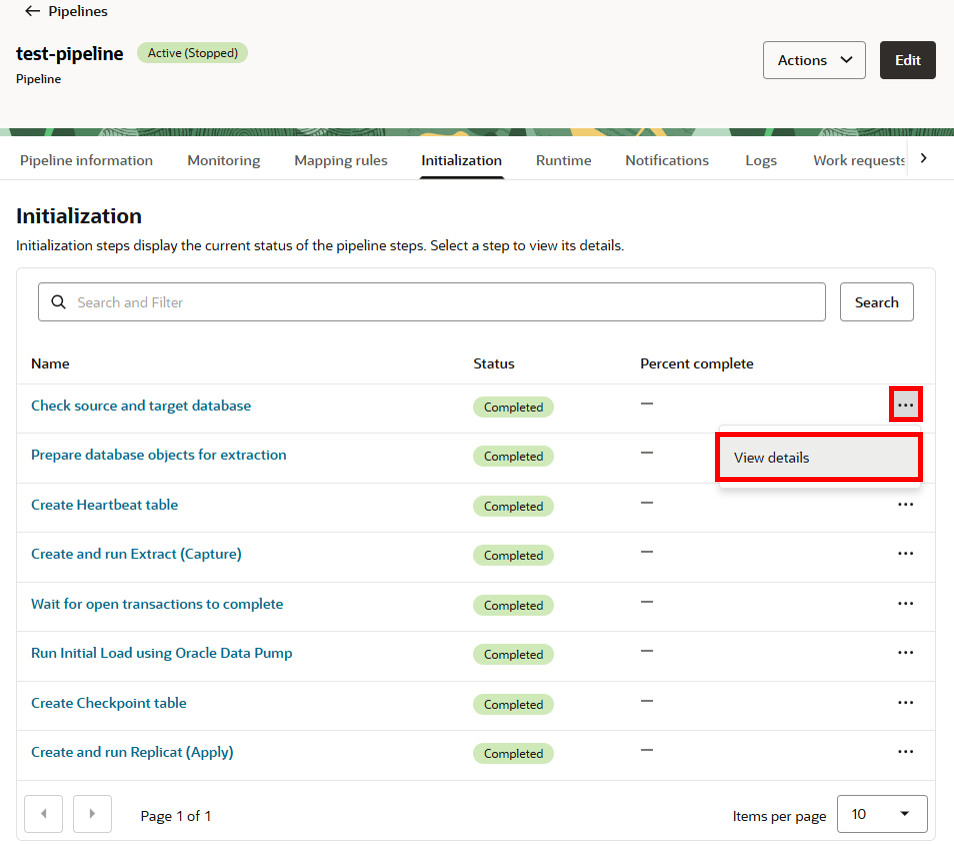

# Create the Oracle Cloud Infrastructure GoldenGate pipeline

## Introduction

In this lab, you learn to create an Oracle Cloud Infrastructure (OCI) GoldenGate pipeline.

Estimated time: 20 minutes

### About Oracle Cloud Infrastructure GoldenGate pipelines

A Oracle Cloud Infrastructure GoldenGate pipeline lets you configure real time data replication flows that support mission critical use cases such as analytics, operational reporting, and hybrid cloud integrations. You can create a pipeline to stream data directly from operational databases to analytical environments without traditional extract, transform, load (ETL) processes. For example, you can set up a pipeline to directly replicate data from Autonomous Transaction Processing to Autonomous Data Warehouse with minimal configuration.

### Objectives

In this lab, you will:
* Create the pipeline
* Enable logging
* Start the pipeline

## Task 1: Create the pipeline

1. Click **Pipelines** and then click **Create pipeline**.

    

2.  The Create ZeroETL Mirror pipeline panel appears. For Name, enter **test-pipeline** and optionally, a description.

3.  For Choose a license tyoe, select **Bring Your Own License (BYOL)**.

4.  For Source connection, select **SourceATP** from the dropdown.

5.  For Target connection, select **TargetADW** from the dropdown.

6. Click **Create pipeline**.

    

## Task 2: Add mapping rules

1. In the Pipelines page, select the pipeline.

2. On the pipeline details page, under the Resources menu, click **Mapping Rules**.

3. Click **Add**.

    

4. In the Add mapping rules dialog, from the Type dropdown, select **Include/Exclude**. For Source, enter x. For Target, enter. Click **Add mapping rules**.

## Task 3: Enable logging

1. On the pipeline details page, under the Resources menu, click **Logs**.

2. In the Logs list, click the three dots icon for your object, and then select **Enable log**.

    

3. In the Enable log dialog, for Log name, enter **critical-events**.

4. From the Compartment dropdown, select **&lt;USER&gt;-COMPARTMENT**.

5. Select **Create new group**.

    

6. In the Create log group dialog, for Name, enter **log-group**.

7. Click **Create**.

    

8. For Log group, select **log-group** from the dropdown.

9. For Log retention, select the number of months from the dropdown.

10. Click **Enable log**.

    

## Task 4: Start the pipeline

1. In the pipelines details page, click **Start**.

    

2. In the Start pipeline dialog, click **Start**.

    

3. On the pipeline's details page, select **Initialization**. The Initialization steps displays the current status of the pipeline steps. For each step, you can select **View details** from its **Actions** menu and review corresponding messages.

    

You may now **proceed to the next lab.**

## Learn more

* [About pipelines](https://docs.oracle.com/en/cloud/paas/goldengate-service/jppjs/)
* [Create pipeline resources](https://docs.oracle.com/en/cloud/paas/goldengate-service/crylk/)

## Acknowledgements
* **Author** - Katherine Wardhana, User Assistance Developer, Database User Assistance
* **Contributors** -  Julien Testut, Database Product Management
* **Last Updated By/Date** - Katherine Wardhana, June 2025